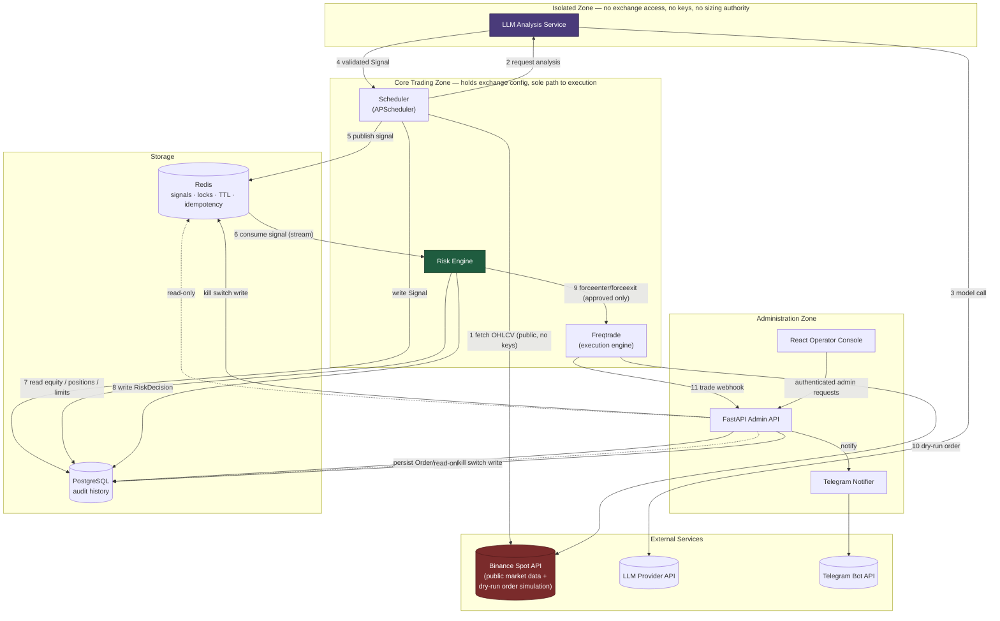
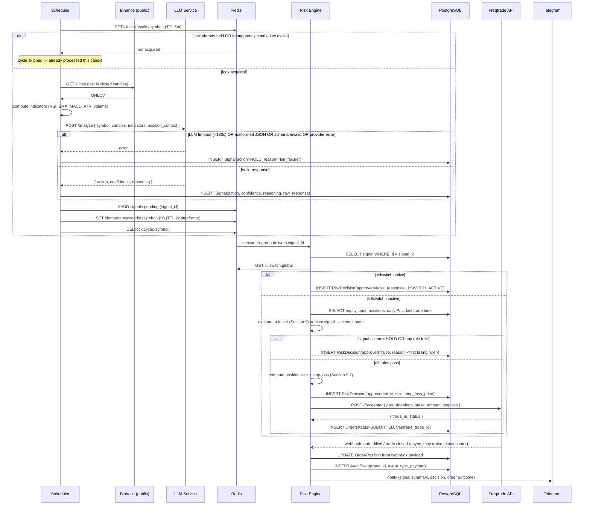
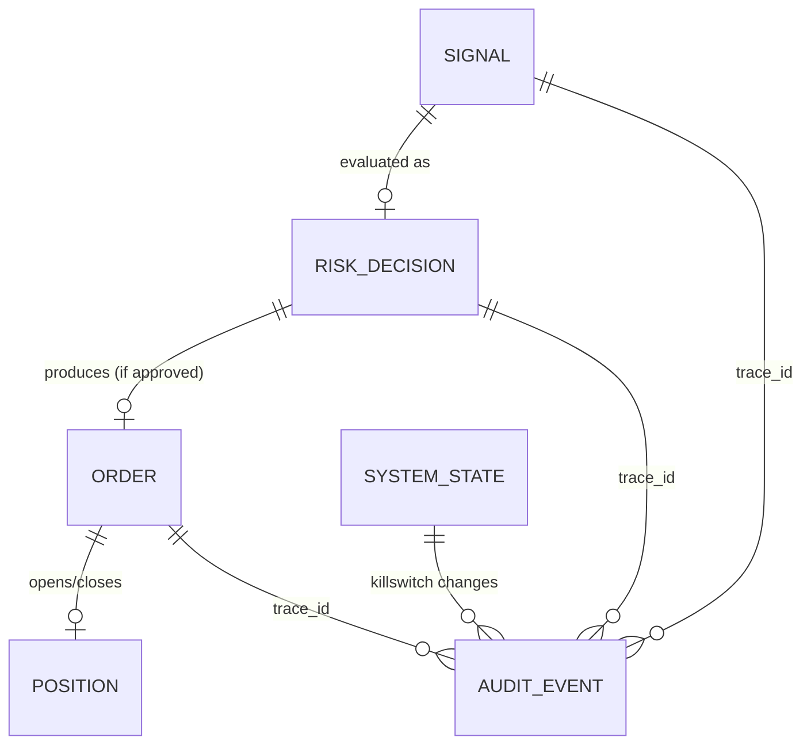

# PROJECT.md — TradeMind

**Self-hosted AI-assisted cryptocurrency trading platform**

| | |
|---|---|
| Status | Draft — MVP specification |
| Scope | Binance Spot, a configurable symbol set (default: BTC/USDT, ETH/USDT, BNB/USDT, USDC/USDT), dry-run |
| Audience | Coding agents and engineers implementing this system |
| Authority | This document is the single source of truth. Any implementation decision that conflicts with it must either conform to it or update it first. |

---

## 1. Executive Summary

TradeMind is a self-hosted platform that uses a Large Language Model (LLM) to analyze cryptocurrency market data and propose a trading action — `BUY`, `SELL`, or `HOLD` — which is then independently validated, sized, and (if approved) executed by deterministic, non-LLM components.

The system is built on one non-negotiable architectural principle:

> **The LLM proposes. The Risk Engine disposes.**

The LLM is a pattern-recognition advisor with **zero execution authority**. It never touches exchange credentials, never talks to Binance, never decides how much capital is at risk, and never has a path to bypass the Risk Engine. Every trading decision — even a `BUY` signal with 99% stated confidence — passes through a deterministic Risk Engine that can downgrade it to `HOLD`, resize it, or reject it outright. All decisions, approvals, rejections, and trades are persisted to PostgreSQL as an immutable audit trail.

The MVP targets a single exchange (Binance Spot), a configurable set of pairs (a `SYMBOLS` env var, comma-separated; defaults to BTC/USDT, ETH/USDT, BNB/USDT, USDC/USDT — see Section 2.1), one timeframe at a time (closed candles only — a `TIMEFRAME` env var picks it; defaults to `5m`, with the four CPU-bound local-model calls staggered 70 seconds apart), long-only positions, dry-run execution, and a single LLM provider. It is designed so that flipping from dry-run to live trading later is a configuration change reviewed by a human, not a code change — and so that adding pairs, exchanges, or LLM providers later does not require re-architecting the trust boundaries described here.

The system fails closed. Whenever any component is uncertain, unavailable, times out, or returns malformed data, the default output is `HOLD` (no new position) — never a best-effort guess.

---

## 2. Goals & Non-Goals

### 2.1 Goals (MVP)

- Run fully self-hosted via Docker Compose, with no dependency on a third-party control plane.
- Analyze each configured symbol (`SYMBOLS` env var; default BTC/USDT, ETH/USDT, BNB/USDT, USDC/USDT) on closed 5-minute candles using one LLM provider.
- Enforce a deterministic Risk Engine that has final authority over every trade: sizing, exposure limits, loss limits, cooldowns, and a global kill switch.
- Execute trades exclusively through Freqtrade, in dry-run mode, against Binance Spot.
- Persist a complete, queryable audit trail of every signal, decision, and order in PostgreSQL.
- Notify a human operator in real time via Telegram, expose system state via a FastAPI admin API, and provide a browser operator console so routine monitoring does not require SSH access.
- Be architected so the LLM component is physically and logically incapable of reaching the exchange or determining position size, even if its own logic is compromised or misbehaves.

### 2.2 Non-Goals (MVP)

Explicitly out of scope for the MVP — do not build these unless the scope in Section 3 (MVP) of this document is revised:

- Live trading with real funds (dry-run only).
- Margin, futures, leverage, or short positions (long-only spot).
- Multi-exchange support or exchange abstraction beyond what Freqtrade already provides.
- More than one timeframe active at once (multi-timeframe ensembling/confirmation). (The symbol count itself is configurable via `SYMBOLS`, not fixed — Section 2.1 — but each additional symbol adds to the Scheduler's per-cycle stagger budget, Section 5.1, and CPU-bound local LLM inference caps how many realistically fit inside one candle period before the stagger guard in `build_scheduler` rejects the configuration.)
- Multiple simultaneous LLM providers, ensembling, or model voting.
- Strategy backtesting/optimization tooling (Freqtrade's own backtesting may be used ad hoc for research, but is not a product feature).
- Portfolio rebalancing, DCA, grid trading, or any strategy family beyond single-entry/single-exit long positions.
- A multi-user public web application or mobile app. The browser console remains a single-operator Administration Zone client; an explicit dry-run-only Compose overlay may publish its login surface by public IP, but this does not make TradeMind a public or multi-tenant product.
- Fully autonomous operation without a human-operable kill switch.
- Horizontal scaling / multi-tenant deployment (single operator, single deployment).

---

## 3. High-Level Architecture

Three trust zones matter more than any other architectural detail in this system:

1. **Isolated Zone** — the LLM Analysis Service. No exchange credentials, no network path to Binance or Freqtrade. Its only output channel is Redis.
2. **Core Trading Zone** — Scheduler, Risk Engine, and Freqtrade. This is the only zone that holds exchange configuration and can cause capital to move (even in dry-run).
3. **Administration Zone** — FastAPI admin API, React operator console, and the Telegram notifier. Read/observe the system and issue control commands (e.g., kill switch); never issue trade orders directly.



**Boundary rule, made explicit:** there is no arrow from `LLM` to `BINANCE`, `FT`, or `PG` writes of anything but a read-only analysis request. The LLM Analysis Service container must not be issued Binance API keys, must not be placed on the same Docker network as Freqtrade, and must have no code path that calls Freqtrade or Binance. This is enforced at three layers: network segmentation (Compose networks), credential distribution (secrets only injected into `risk_engine` and `freqtrade` containers), and code review (Section 14).

---

## 4. Component Responsibilities

| Component | Responsibility | Owns | Must Never Do |
|---|---|---|---|
| **LLM Analysis Service** | Given market context, return a structured `{action, confidence, reasoning}` opinion | Prompt construction, model invocation, output schema validation | Access Binance or Freqtrade; hold API keys; see account balance/equity; determine position size; retry into a non-`HOLD` fallback |
| **Scheduler** | Trigger one trading cycle per pair on every closed candle (`TIMEFRAME`, default `5m`); orchestrate data fetch → LLM call → signal publish | Cycle timing, market data fetch, indicator computation, Redis lock/idempotency for the cycle | Approve or size trades; call Freqtrade directly |
| **Risk Engine** | Sole authority to approve, reject, or resize every signal before execution | Risk rules (Section 9), position sizing, kill switch enforcement, RiskDecision persistence | Execute orders itself (must go through Freqtrade's API); trust LLM confidence/sizing hints without validation |
| **Freqtrade** | Execute and manage trades against Binance Spot; own stop-loss/ROI enforcement at the exchange-interaction layer | Exchange connectivity, order placement, dry-run wallet simulation, its own internal trade bookkeeping | Originate entry signals (its strategy has no autonomous entry logic in this system); accept commands from anything other than the Risk Engine's authenticated calls |
| **Binance Spot** | Exchange — source of market data and (in dry-run) simulated order execution | N/A (external) | N/A |
| **PostgreSQL** | Durable, queryable audit history: every signal, decision, order, position, and system-state change | `signals`, `risk_decisions`, `orders`, `positions`, `audit_events`, `system_state` | Be bypassed — no component may take an action that changes trading state without a corresponding row written here |
| **Redis** | Low-latency coordination: pending-signal queue, per-cycle locks, idempotency keys, cached latest state, kill-switch flag cache | Ephemeral/coordination state only (Section 10.2) | Be the system of record — anything in Redis that matters for audit must also land in PostgreSQL |
| **FastAPI Admin API** | Human-facing read/observe/control surface | HTTP interface, auth, kill-switch endpoint, config read/patch, Freqtrade webhook ingestion | Place trades directly; expose exchange credentials |
| **React Operator Console** | Browser-based single-operator view over the Admin API | Present signals, decisions, orders, positions, P&L, audit timelines, and existing administrative controls | Connect directly to Postgres, Redis, Binance, or Freqtrade; place or approve orders; embed the Admin API key in its image |
| **Telegram Notifier** | Push real-time notifications for signals, decisions, orders, and kill-switch events | Outbound Telegram messages only | Be a control channel for anything beyond a documented kill-switch command (Section 11) |

---

## 5. Trading Cycle

One full cycle runs independently per symbol, triggered by the Scheduler at each closed candle boundary for the configured `TIMEFRAME` (plus a fixed settle delay, e.g. `:00 + 15s`, to avoid racing exchange candle finalization). Symbols within a cycle are staggered by `SchedulerSettings.symbol_stagger_seconds` (default 190s) so they don't call the LLM Analysis Service at the same instant — on a single CPU-bound local model, simultaneous calls queue and can blow the analyze timeout.

### 5.1 Summary

| Step | Actor | Action | Safe default on failure |
|---|---|---|---|
| 1 | Scheduler | Acquire per-symbol lock + check idempotency key | Skip cycle (already processed) |
| 2 | Scheduler | Fetch closed candles from Binance, compute indicators | — |
| 3 | LLM Service | Classify as `BUY`/`SELL`/`HOLD` with confidence + reasoning | Timeout, bad JSON, or invalid schema → `HOLD` |
| 4 | Scheduler | Persist `Signal` to Postgres, publish to Redis stream | — |
| 5 | Risk Engine | Check kill switch | Active → reject, no further evaluation |
| 6 | Risk Engine | Evaluate rule set (Section 9) against signal + account state | Any rule fails, or signal was `HOLD` → reject with reason, no order |
| 7 | Risk Engine | Compute position size + stop-loss, persist `RiskDecision(approved=true)` | Only reached if step 6 fully passes |
| 8 | Risk Engine | Call Freqtrade `forceenter`, persist `Order(SUBMITTED)` | Freqtrade unreachable → `Order(FAILED)`, alert (Section 9.4) |
| 9 | Freqtrade → Risk Engine | Async webhook on fill/close updates `Order`/`Position` | No webhook within window → reconciliation job (Phase 5) |
| 10 | Risk Engine | Write `AuditEvent`, notify Telegram | Telegram down → logged, never blocks decisioning |

Every step writes to Postgres before or as it completes — there is no step in this cycle that changes trading state without a corresponding audit row. The full sequence, including the exact message shapes and branch conditions, is below.



**Key properties of this design:**

- The lock + idempotency key pair guarantees at-most-one signal is generated per `(symbol, candle_ts)`, even if the Scheduler is restarted or run with multiple replicas.
- Redis Streams with a consumer group give the Risk Engine at-least-once delivery; the Risk Engine's own idempotency check (Section 9.3) makes re-delivery safe (no duplicate orders).
- The Freqtrade webhook callback is asynchronous and decoupled from the synchronous `forceenter` call — order *submission* and order *fill* are tracked as separate states (`SUBMITTED` → `FILLED`/`FAILED`).
- Every branch that isn't "all rules pass" still writes a row to `PostgreSQL` and (for rejections after a real signal) a Telegram notification — silence is never a valid outcome of a cycle.

---

## 6. Repository Structure

Monorepo, multiple containers. `common` is a shared, versioned internal package installed into every service image; it is the only code allowed to define the domain models and Redis key schema, so no service can drift from the shared contract.

```
trademind/
├── PROJECT.md
├── docker-compose.yml
├── docker-compose.override.yml.example
├── .env.example
├── Makefile
├── pyproject.toml
├── alembic.ini
├── migrations/
│   └── versions/
├── services/
│   ├── llm_service/
│   │   ├── app/
│   │   │   ├── main.py            # FastAPI app: POST /analyze
│   │   │   ├── prompts/           # versioned prompt templates
│   │   │   ├── providers/         # one interface, anthropic + ollama implementations
│   │   │   ├── schemas.py         # pydantic input/output contracts (Section 8)
│   │   │   └── validators.py      # schema + range validation, HOLD fallback
│   │   ├── Dockerfile
│   │   └── tests/
│   ├── scheduler/
│   │   ├── app/
│   │   │   ├── main.py            # APScheduler bootstrap
│   │   │   ├── jobs.py            # per-symbol cycle job
│   │   │   ├── market_data.py     # Binance public REST client (ccxt)
│   │   │   ├── indicators.py      # RSI/EMA/MACD/ATR computation
│   │   │   └── sentiment/          # advisory weighted sentiment providers + service
│   │   ├── Dockerfile
│   │   └── tests/
│   ├── risk_engine/
│   │   ├── app/
│   │   │   ├── main.py            # Redis Streams consumer entrypoint
│   │   │   ├── rules/             # one module per rule row in Section 9
│   │   │   ├── sizing.py          # position sizing formula
│   │   │   ├── freqtrade_client.py
│   │   │   └── kill_switch.py
│   │   ├── Dockerfile
│   │   └── tests/                 # one test file per rule, minimum
│   ├── admin_api/
│   │   ├── app/
│   │   │   ├── main.py
│   │   │   ├── routers/           # signals.py, decisions.py, positions.py,
│   │   │   │                      # killswitch.py, config.py, webhooks.py
│   │   │   ├── auth.py            # API key dependency
│   │   │   └── schemas.py
│   │   ├── Dockerfile
│   │   └── tests/
│   ├── notifier/
│   │   ├── app/
│   │   │   ├── main.py            # subscribes to audit events, sends Telegram
│   │   │   └── telegram_client.py
│   │   ├── Dockerfile
│   │   └── tests/
│   └── common/
│       ├── db/                    # SQLAlchemy 2 models + session factory
│       ├── redis_keys.py          # single source of truth for key naming (Section 10.2)
│       ├── enums.py               # Action, RejectionReason, OrderStatus, ...
│       └── config.py              # typed settings loader (pydantic-settings)
├── freqtrade/
│   ├── user_data/
│   │   ├── strategies/
│   │   │   └── ExternalSignalStrategy.py   # no autonomous entries; stoploss/ROI safety net only
│   │   └── config.json.tpl     # rendered to config.json at container start (docker-entrypoint.sh)
│   │                           # — secrets (WEBHOOK_SHARED_SECRET, FREQTRADE_API_USER/PASS,
│   │                           # FREQTRADE_JWT_SECRET) are env vars, never baked into the image
│   ├── docker-entrypoint.sh
│   └── Dockerfile
├── frontend/                       # React/TypeScript operator console
│   ├── src/                        # typed API client and dashboard views
│   ├── nginx.conf                  # static hosting + /api reverse proxy
│   └── Dockerfile
├── scripts/
│   └── seed_dev_data.py
└── tests/
    └── integration/                # full-stack docker-compose test scenarios
```

**Environment variables (`.env.example`), minimum set:**

| Variable | Consumed by | Purpose |
|---|---|---|
| `POSTGRES_DSN` | all services | Shared audit database connection |
| `REDIS_URL` | all services | Coordination store connection |
| `LLM_PROVIDER` | llm_service | Selects the single configured provider adapter: `anthropic` (hosted) or `ollama` (self-hosted) |
| `LLM_API_KEY` | llm_service only | Anthropic provider only. Never injected into any other container |
| `OLLAMA_BASE_URL` / `OLLAMA_MODEL` | llm_service only | Ollama provider only. Base URL of the self-hosted Ollama server (the `ollama` Compose service, isolated-zone-only per Section 3) and the model tag to request |
| `BINANCE_API_KEY` / `BINANCE_API_SECRET` | freqtrade, risk_engine only | Never injected into llm_service, admin_api, or notifier |
| `TELEGRAM_BOT_TOKEN` / `TELEGRAM_CHAT_ID` | notifier | Outbound notifications |
| `ADMIN_API_KEY` | admin_api | Auth for the admin API |
| `FREQTRADE_API_URL` / `FREQTRADE_API_USER` / `FREQTRADE_API_PASS` | risk_engine | Internal-network-only Freqtrade REST credentials |
| `DRY_RUN` | freqtrade, risk_engine | Must be `true` for MVP; flipping requires human review (Section 14) |
| `WEBHOOK_SHARED_SECRET` | freqtrade, admin_api | Authenticates the Freqtrade → admin_api webhook |

---

## 7. Domain Models

Persisted entities live in PostgreSQL and are the audit system of record. Freqtrade retains its own internal trade database in a persistent SQLite volume purely for its own execution bookkeeping — TradeMind does not treat it as authoritative and mirrors the state it cares about into `orders`/`positions` via the webhook, so the audit trail is stable even if Freqtrade's internal schema changes across versions. Persisting SQLite prevents Freqtrade trade IDs from being reused after routine container recreation; webhook, reconciliation, and exit-order matching still validate both the trade ID and symbol.

Every row created during a single trading-cycle run shares a `trace_id` (UUID, minted by the Scheduler at cycle start), enabling a single query to reconstruct the full decision path from signal to (eventual) position close.

### 7.1 Signal

| Field | Type | Notes |
|---|---|---|
| `id` | UUID, PK | |
| `trace_id` | UUID | Correlates to RiskDecision, Order, AuditEvent |
| `symbol` | text | One of the configured `SYMBOLS` (default: `BTC/USDT`, `ETH/USDT`, `BNB/USDT`, `USDC/USDT`) |
| `timeframe` | text | `TIMEFRAME` env var (default `5m`) |
| `candle_ts` | timestamptz | Close time of the candle this signal was based on |
| `action` | enum | `BUY` \| `SELL` \| `HOLD` |
| `confidence` | numeric(3,2) | `0.00`–`1.00`; model-reported unless the deterministic exit semantic validator normalizes the action (Section 8.3) |
| `reasoning` | text | Truncated to 500 chars; deterministic exit evidence replaces contradictory model reasoning when Section 8.3 normalizes an action |
| `model_name` | text | e.g. `provider:model-version` |
| `raw_response` | jsonb | Full LLM response plus original/normalized action and deterministic exit-confirmation metadata for audit/debugging |
| `model_input` | jsonb, nullable | The exact `/analyze` request body this signal was produced from (Section 8.1 shape: `ohlcv`, `indicators`, `sentiment`, `position_context`), minus `provider_override`. Nullable because rows created before this field was added have none |
| `price` | numeric | Close price of `candle_ts`. Added in Phase 2: the Section 9.2 sizing formula needs the entry price that produced this signal, and this is the only place it survives past the LLM call |
| `atr_14` | numeric | ATR(14) at `candle_ts`, same rationale as `price` — Section 9.2's stop-distance calculation is not derivable without it |
| `status` | enum | `PENDING` \| `CONSUMED` \| `EXPIRED` |
| `created_at` | timestamptz | |

### 7.2 RiskDecision

| Field | Type | Notes |
|---|---|---|
| `id` | UUID, PK | |
| `trace_id` | UUID | |
| `signal_id` | UUID, FK → Signal | |
| `approved` | boolean | |
| `rejection_reason` | enum, nullable | See Section 9.3 |
| `position_size_usdt` | numeric, nullable | Set only if approved |
| `position_size_base` | numeric, nullable | BTC/ETH amount |
| `stop_loss_price` | numeric, nullable | |
| `equity_snapshot_usdt` | numeric | Account equity at decision time |
| `risk_pct_applied` | numeric, nullable | |
| `created_at` | timestamptz | |

### 7.3 Order

| Field | Type | Notes |
|---|---|---|
| `id` | UUID, PK | |
| `trace_id` | UUID | |
| `risk_decision_id` | UUID, FK → RiskDecision | |
| `freqtrade_trade_id` | integer, nullable | Populated once Freqtrade accepts the entry |
| `symbol` | text | |
| `side` | enum | `BUY` \| `SELL` |
| `status` | enum | `SUBMITTED` \| `FILLED` \| `FAILED` \| `CANCELLED` |
| `requested_amount` | numeric | |
| `filled_amount` | numeric, nullable | |
| `avg_price` | numeric, nullable | |
| `dry_run` | boolean | Always `true` for MVP |
| `created_at` / `updated_at` | timestamptz | |

### 7.4 Position

| Field | Type | Notes |
|---|---|---|
| `id` | UUID, PK | |
| `symbol` | text | |
| `status` | enum | `OPEN` \| `CLOSED` |
| `entry_order_id` | UUID, FK → Order | |
| `exit_order_id` | UUID, FK → Order, nullable | |
| `entry_price` / `exit_price` | numeric | |
| `amount` | numeric | |
| `pnl_usdt` / `pnl_pct` | numeric, nullable | Set on close |
| `opened_at` / `closed_at` | timestamptz | |

`GET /positions` enriches open-position responses with non-persisted
`current_price`, `current_value_usdt`, `unrealized_pnl_usdt`,
`unrealized_pnl_pct`, and `price_updated_at` fields derived from the latest
persisted closed-candle `Signal` for that symbol. These are gross monitoring
estimates before exit fees, not execution inputs; the operator console must
show the mark timestamp and never fetch Binance directly.

### 7.5 AuditEvent (append-only)

| Field | Type | Notes |
|---|---|---|
| `id` | UUID, PK | |
| `trace_id` | UUID | |
| `event_type` | enum | `SIGNAL_RECEIVED`, `SIGNAL_VALIDATION_FAILED`, `RISK_APPROVED`, `RISK_REJECTED`, `ORDER_SUBMITTED`, `ORDER_FILLED`, `ORDER_FAILED`, `ORDER_CANCELLED`, `POSITION_OPENED`, `POSITION_CLOSED`, `KILLSWITCH_ENABLED`, `KILLSWITCH_DISABLED`, `CONFIG_CHANGED`, `RECONCILIATION_REQUIRED` |
| `payload` | jsonb | Event-specific detail |
| `created_at` | timestamptz | |

### 7.6 SystemState

Singleton table (single row, `id = 1`), Postgres as durable source of truth; Redis holds a cached copy for fast reads on the hot path (Section 10.2).

| Field | Type | Notes |
|---|---|---|
| `killswitch_enabled` | boolean | Default `false` |
| `killswitch_reason` | text, nullable | |
| `killswitch_updated_by` | text, nullable | API caller or `SYSTEM` (auto-trip) |
| `updated_at` | timestamptz | |

### 7.7 Example: a fully approved cycle, in JSON

```json
{
  "signal": {
    "id": "b3f1...",
    "trace_id": "2f7a...",
    "symbol": "BTC/USDT",
    "timeframe": "1h",
    "candle_ts": "2026-07-15T13:00:00Z",
    "action": "BUY",
    "confidence": 0.78,
    "reasoning": "RSI(14) recovering from oversold (31->44), price reclaimed EMA50 with rising volume.",
    "model_name": "anthropic:claude-sonnet-5",
    "status": "CONSUMED"
  },
  "risk_decision": {
    "id": "c91e...",
    "trace_id": "2f7a...",
    "signal_id": "b3f1...",
    "approved": true,
    "rejection_reason": null,
    "position_size_usdt": 250.00,
    "stop_loss_price": 61250.00,
    "equity_snapshot_usdt": 5000.00,
    "risk_pct_applied": 0.01
  },
  "order": {
    "id": "9d02...",
    "trace_id": "2f7a...",
    "risk_decision_id": "c91e...",
    "freqtrade_trade_id": 142,
    "symbol": "BTC/USDT",
    "side": "BUY",
    "status": "FILLED",
    "requested_amount": 250.00,
    "filled_amount": 250.00,
    "avg_price": 62500.12,
    "dry_run": true
  }
}
```

---

## 8. LLM Contract

The LLM Analysis Service exposes exactly one endpoint internally: `POST /analyze`. It is a pure function from market context to opinion — no memory of prior calls beyond what is explicitly passed in `position_context`, no side effects.

### 8.1 Input — what the LLM receives

```json
{
  "symbol": "BTC/USDT",
  "timeframe": "1h",
  "candle_close_time": "2026-07-15T13:00:00Z",
  "ohlcv": [
    { "t": "2026-07-15T12:00:00Z", "o": 62100.5, "h": 62700.0, "l": 61950.0, "c": 62480.2, "v": 812.4 }
  ],
  "indicators": {
    "rsi_14": 44.2,
    "ema_50": 61980.1,
    "ema_200": 59340.7,
    "macd": { "macd": 120.4, "signal": 98.1, "histogram": 22.3 },
    "atr_14": 780.5,
    "volume_sma_20": 690.2
  },
  "sentiment": {
    "score": 25,
    "state": "FEAR",
    "confidence": 0.85,
    "reasons": [
      "RSI(14) is oversold at 25.0",
      "Price is below EMA50 and EMA200",
      "High volatility: ATR is 5.2% of price"
    ]
  },
  "position_context": {
    "has_open_position": false,
    "unrealized_pnl_pct": null
  }
}
```

`ohlcv` contains the model's recent-candle context — the last `llm_ohlcv_window` closed candles (`common/config.py`, default 4), distinct from the larger `candle_lookback` (default 200) the Scheduler fetches for indicator computation. Four candles preserve enough context to evaluate the rubric's three-candle higher/lower-highs-and-lows pattern while keeping the CPU-only `qwen2.5:7b` request small enough for the four-symbol, five-minute stagger budget. Indicators such as `ema_200` need the full lookback to be accurate; the LLM itself only needs enough raw candles for qualitative recent-price context, since every indicator it needs is already computed and included in `indicators` below — sending all 200 raw candles needlessly bloats the prompt and, on CPU-bound local providers (Section 8.4's `ollama` provider), risks consuming the entire bounded `/analyze` budget (Section 8.3) before generation starts. `sentiment` is deterministic, advisory context computed by the Scheduler's `MarketSentimentService`; it cannot create a signal, size a position, approve risk, or execute a trade. `position_context` tells the model only *whether* a position is currently open, so it can reason about exit conditions — it is a status flag, never a sizing or balance figure.

### 8.1.1 Market Sentiment Engine

The framework-agnostic sentiment engine converts the latest closed-candle indicators into `FEAR` (0–30), `NEUTRAL` (31–70), or `GREED` (71–100). RSI, EMA trend, MACD, ATR volatility, and volume are independent providers implementing the same interface. A provider returns a score, confidence, and human-readable reason, or `None` when its required inputs are missing. New providers are injected into `MarketSentimentService`; the service itself does not need modification.

Configured weights are keyed by provider name. Aggregation uses `weight × provider confidence` as the effective score weight, so uncertain evidence has less influence. Missing providers are omitted and score weights are renormalized. Overall confidence also measures coverage: it is the configured-weighted mean across all enabled providers, with an unavailable provider contributing zero confidence. If none can evaluate, the safe advisory result is neutral with score `50`, confidence `0.0`, and an explicit missing-data reason. This fallback is context only and does not alter the separate rule that uncertain LLM classification resolves to `HOLD`.

**Fields explicitly excluded from the input, by design** — the LLM must never see or infer from these:

| Excluded field | Reason |
|---|---|
| Account balance / available funds | Prevents the model from anchoring its confidence or reasoning on capital, and prevents any path from "opinion" to "sizing" |
| API keys / secrets | Isolated zone has none to leak |
| Wallet address | Not needed for market analysis |
| Suggested order size / leverage | Sizing is exclusively a Risk Engine responsibility |

### 8.2 Output — strict contract

```json
{
  "action": "BUY",
  "confidence": 0.78,
  "reasoning": "RSI(14) recovering from oversold (31->44), price reclaimed EMA50 with rising volume.",
  "key_indicators": ["rsi_recovery", "ema50_reclaim", "volume_increase"],
  "invalidation_condition": "Close back below EMA50 (61980) on the next candle."
}
```

| Field | Constraint |
|---|---|
| `action` | Must be exactly one of `BUY`, `SELL`, `HOLD` — no free text, no additional values |
| `confidence` | Float in `[0.0, 1.0]` |
| `reasoning` | Non-empty string, ≤ 500 characters |
| `key_indicators` | Array of short strings, may be empty |
| `invalidation_condition` | Non-empty string describing what would change the thesis |

### 8.3 Validation pipeline (`validators.py`)

Executed on every model response, in order. The first structural failure short-circuits to `HOLD`:

1. Response is valid JSON.
2. Response conforms to the JSON Schema above (required fields present, correct types).
3. `action` is one of the three allowed enum values.
4. `confidence` is within `[0.0, 1.0]`.
5. `reasoning` length is within bounds.

After structural validation, `semantic_validator.py` deterministically enforces the position-aware exit rubric using only the supplied closed candles and indicators. Provider failures and structurally invalid responses never reach this step and remain `HOLD`. For a valid response:

- With no open position, a model-proposed `SELL` is normalized to `HOLD`.
- With an open position, `SELL` requires both (a) at least two confirmations from the list encoded in the prompt, spanning at least two of its three categories — trend (price below EMA50 and EMA200; EMA50 below EMA200), momentum (bearish MACD: negative histogram and MACD below signal; RSI below 45), price action (lower highs and lower lows across the latest three candles; falling close on volume above SMA20) — and (b) `position_context.unrealized_pnl_pct` known and positive. Two confirmations from the same category do not satisfy the rubric: trend and momentum confirmations each move in highly-correlated pairs, so a same-category pair is materially weaker evidence than a cross-category one. The rubric only ever locks in an existing gain ahead of a reversal — it never forces an exit that would realize a loss, so an unprofitable or unknown-PnL position stays `HOLD` regardless of how many bearish confirmations agree.
- When both conditions hold, the output is normalized to `SELL` even if the model returned `HOLD` or `BUY`. When either is unmet, a model-proposed `SELL` or impossible duplicate `BUY` is normalized to `HOLD`.
- The raw model response, original action, normalized action, and counted confirmations are all retained in `raw_response`. This is deterministic contract validation inside the isolated analysis service, not execution authority: the resulting `SELL` still passes through Section 9.1.1 and only the Risk Engine may call Freqtrade.

| Failure mode | Behavior |
|---|---|
| Provider HTTP error / connection failure | One retry with backoff (max 1 retry, total budget 180s), then `HOLD` |
| Timeout (> 180s total, including retry) | `HOLD` |
| Malformed / non-JSON response | `HOLD` (no retry — treat as a prompt/model problem, not a transient one) |
| Schema validation failure (missing/extra/wrong-typed fields) | `HOLD` |
| `action` outside enum | `HOLD` |
| `confidence` outside `[0,1]` | `HOLD` |

Every fallback-to-`HOLD` still produces a `Signal` row with `reasoning` overwritten to describe the failure (e.g. `"llm_timeout"`, `"schema_invalid"`), so failures are visible in the audit trail and in Telegram, not silently swallowed.

### 8.4 Provider abstraction

One interface (`providers/base.py`), selected by the single `LLM_PROVIDER` value configured for the deployment — never more than one active provider at a time (Section 2.2 rules out ensembling/model voting). Two concrete implementations exist:

- `anthropic` (`providers/anthropic_provider.py`) — hosted API, requires `LLM_API_KEY`.
- `ollama` (`providers/ollama_provider.py`) — self-hosted, talks to the `ollama` Compose service (isolated-zone-only, Section 3) over `OLLAMA_BASE_URL`, requires no external API key or account.

Anthropic requests schema-constrained structured output via `output_config` against `OUTPUT_SCHEMA` (`providers/output_schema.py`, the JSON Schema in Section 8.2). Ollama deliberately does not: measured on CPU inference, llama.cpp's grammar-constrained decoding dropped generation to ~0.3 tokens/sec (vs ~48 tokens/sec unconstrained prefill on the same request) — enough to blow the bounded `/analyze` budget regardless of prompt size. Ollama instead relies on free-form generation plus the system prompt's "respond with ONLY the JSON object" instruction; either provider's non-conforming output falls back safely to `HOLD` through the same `validators.py` pipeline (Section 8.3), so the difference is a performance tradeoff for CPU-bound inference, not a contract difference downstream callers need to know about. The interface exists so a provider can be swapped or a further one added later without touching `main.py`, `validators.py`, or any downstream contract — not as a speculative plugin system. Do not build a provider registry, dynamic loading, or multi-provider routing for the MVP (Section 2.2).

**Runtime-configurable levers.** Which provider/model/temperature is active does not require an `llm_service` restart. `LLM_PROVIDER`/`ANTHROPIC_MODEL`/`OLLAMA_MODEL`/`OLLAMA_TEMPERATURE` are env-sourced defaults as above, layered with whatever has been persisted via `PATCH /config/llm` (Section 11) — same override-table pattern as `RiskConfig` (Section 9.1). The one difference: `llm_service` never reads this table itself, since it has no Postgres access (Section 3's Isolated Zone stays off `core_net`). Instead the Scheduler — which already holds a Postgres session and already calls `/analyze` every cycle — loads the effective config (`common/llm_config_store.py`) and forwards it as `AnalyzeRequest.provider_override`; `main.py` applies it on top of the service's own env settings for that one call only. `provider_override` is excluded from `build_user_prompt()`'s output — it is request-routing metadata, not part of the Section 8.1 input contract, and must never reach the model.

### 8.5 System prompt constraints (skeleton)

The exact prompt text is an implementation detail tuned during Phase 1, but it must encode these constraints regardless of wording:

```
You are a market analysis assistant. You have NO authority to execute trades,
size positions, or access any account. You only classify the provided market
data as BUY, SELL, or HOLD, with a confidence score and reasoning.

Rules:
- Base your answer ONLY on the data provided in this request. Do not assume
  access to real-time data, news, or account information you were not given.
- Respond with ONLY the JSON object described by the schema. No prose outside it.
- If the signal is ambiguous, conflicting, or low-conviction, respond HOLD.
- Never invent indicator values that were not provided.
- Interpret actions using the long-only position context: BUY may only open a
  new position when `has_open_position=false`; SELL may only close an existing
  position when `has_open_position=true`; bearish evidence with no position is
  HOLD.
- Require at least three independent, directionally aligned confirmations for
  BUY. Require at least two for SELL, but spanning at least two of the three
  confirmation categories (trend, momentum, price action) — not two from the
  same category. Price/EMA trend and MACD/RSI momentum must be represented;
  sentiment is advisory and ATR is volatility, so neither counts as directional
  confirmation.
- Do not include phrase-rich BUY/SELL/HOLD examples in the production prompt.
  Small local models can copy their wording and action instead of evaluating
  the request. State the output fields and decision rubric directly.
- The default local model is `qwen2.5:7b`. Smaller 3B-class models are not an
  accepted production default for this rubric because dry-run validation found
  repeated contradictions of supplied RSI/EMA/MACD values and copied prompt
  phrases. Any replacement model must pass fixed bearish-open-position and
  bullish-no-position fixtures within the 180-second analysis budget.
```

---

## 9. Risk Engine Rules

The Risk Engine is a pure, deterministic function of `(signal, account_state, risk_config) → RiskDecision`. It contains no LLM calls and no non-deterministic behavior. Every rule below must have a corresponding unit test before merge (Section 14).

### 9.1 Rule set (MVP defaults)

Defaults live in a single versioned config object, editable only via `PATCH /config` (Section 11) and always audited (`CONFIG_CHANGED` event):

`max_open_positions` is the sole runtime authority for the number of concurrent
positions. Freqtrade is configured with `max_open_trades = -1` so it does not
maintain a second, static limit that can diverge from an audited UI update.
Its finite `stake_amount` is only a configuration-valid fallback; every entry
uses the Risk Engine's explicit, deterministic `stakeamount` from Section 9.2.
This does not bypass risk controls: Freqtrade has no autonomous entry logic and
only the Risk Engine may call its authenticated `forceenter` endpoint after all
rules below pass. Pair uniqueness, total exposure, sizing, and available balance
remain independent gates.

```json
{
  "risk_per_trade_pct": 0.01,
  "max_position_pct": 0.05,
  "max_total_exposure_pct": 0.20,
  "max_open_positions": 2,
  "max_daily_loss_pct": 0.03,
  "consecutive_loss_limit": 3,
  "cooldown_minutes": 120,
  "min_confidence": 0.70,
  "signal_max_age_minutes": 25,
  "atr_stop_multiplier": 2.0,
  "min_stop_loss_pct": 0.015,
  "max_stop_loss_pct": 0.08,
  "dry_run": true
}
```

| # | Rule | Parameter | Behavior when violated |
|---|---|---|---|
| 1 | Kill switch | `killswitch_enabled` | **First gate, always checked first.** Reject everything with `KILLSWITCH_ACTIVE` |
| 2 | Duplicate signal | Redis `idempotency:decision:{signal_id}` | Reject silently (log only, no duplicate notification) with `DUPLICATE_SIGNAL` |
| 3 | Signal action | `action != HOLD` | `action = HOLD` is never "rejected" — it's recorded as `approved=false, reason=SIGNAL_WAS_HOLD` and generates no order |
| 4 | Signal staleness | `signal_max_age_minutes = 25` | If `now - candle_close_time` (plus processing delay) exceeds this, reject with `STALE_SIGNAL`; 25 minutes covers the configured 16-symbol CPU inference stagger while remaining below one 30-minute candle |
| 5 | Minimum confidence | `min_confidence = 0.70` | Reject with `LOW_CONFIDENCE` |
| 6 | Max open positions | `max_open_positions = 2` | Reject with `MAX_POSITIONS_REACHED` if the pair already has an open position, or total open positions ≥ limit |
| 7 | Max total exposure | `max_total_exposure_pct = 20%` | Reject with `MAX_EXPOSURE_REACHED` if adding this position would exceed the cap |
| 8 | Max daily loss (circuit breaker) | `max_daily_loss_pct = 3%` | If realized+unrealized daily PnL ≤ `-3%` of equity, **auto-enable the global kill switch** (`SYSTEM` actor) and reject with `DAILY_LOSS_LIMIT_HIT` |
| 9 | Consecutive losses | `consecutive_loss_limit = 3` | After 3 consecutive losing closed positions, pause new entries (all pairs) for `cooldown_minutes`; reject with `CONSECUTIVE_LOSS_PAUSE` |
| 10 | Per-pair cooldown | `cooldown_minutes = 120` | Reject with `COOLDOWN_ACTIVE` if a position on this pair closed within the cooldown window |
| 11 | Insufficient balance | Freqtrade-reported free balance | Reject with `INSUFFICIENT_BALANCE` if computed size exceeds available funds |
| 12 | Stop-loss required | every approved entry carries a stop | No conditional — stop-loss price is always computed and attached (Section 9.2); this is not a rejection rule, it's an invariant of approval |

Rules are evaluated in the listed order; the **first** failing rule determines `rejection_reason` (rules are short-circuited — a stale signal that also has low confidence is reported as `STALE_SIGNAL`, not both).

### 9.1.1 Exit evaluation (`SELL` signals)

Section 9.1's rule table governs entries (`action = BUY`, or `action = HOLD` which never proceeds past rule 3). The system is long-only (Section 2.2), so a `SELL` signal is not a second kind of entry — it is a request to close an existing open position, evaluated by a separate, deliberately lighter pipeline (`risk_engine/app/exit_evaluator.py`) rather than Section 9.1's rule set:

| Check | Behavior when violated |
|---|---|
| Duplicate signal (same as rule 2) | Reject with `DUPLICATE_SIGNAL` |
| Signal staleness (same as rule 4) | Reject with `STALE_SIGNAL` |
| Open position exists for this symbol | If none, reject with `NO_POSITION_TO_EXIT` — a `SELL` with nothing to close is a no-op, not a rejection of a real opportunity |

On approval, the Risk Engine calls Freqtrade's `forceexit` (not `forceenter`) against the open position's Freqtrade trade ID.

Deliberately **not** checked: the kill switch and minimum confidence. The kill switch halts new *entries* (Section 11/13: "blocks every subsequent entry") — it must never block getting *out* of risk. Minimum confidence exists to gate new exposure; exits reduce risk, so the bias here is toward allowing them, not gating them the way Section 9.1 gates new positions.

### 9.2 Position sizing

Fixed-fractional risk sizing, using ATR for stop distance:

```
risk_amount_usdt   = equity_usdt * risk_per_trade_pct
stop_distance_pct  = clamp(atr_14 / price * atr_stop_multiplier,
                            min_stop_loss_pct, max_stop_loss_pct)
raw_size_usdt       = risk_amount_usdt / stop_distance_pct

position_size_usdt = min(
    raw_size_usdt,
    equity_usdt * max_position_pct,
    free_balance_usdt
)

stop_loss_price = entry_price * (1 - stop_distance_pct)   # long-only, MVP
```

All monetary and sizing arithmetic uses fixed-point/`Decimal` types — never floating point — to avoid rounding drift in audit figures and order amounts.

Take-profit for the MVP is **not** computed per-trade by the Risk Engine; it is enforced by Freqtrade's static `minimal_roi` table (the `minimal_roi` class attribute on `ExternalSignalStrategy.py` — Freqtrade config.json does not override it here) as a simple, auditable safety net. Per-trade computed take-profit/reward-risk ratios are a candidate for a later phase, not MVP (Section 2.2).

Because this table is the only exit mechanism that fires unconditionally on a timer — the position-aware `SELL` rubric (Section 8.1/8.3) is deliberately conservative and may never trigger within a given trade's lifetime — its tiers are calibrated to the traded pairs' actual hourly volatility (~0.5-0.8% ATR) rather than generic defaults, and its floor is pinned to `min_exit_profit_pct` (`services/llm_service/app/semantic_validator.py`, currently 0.5%) rather than 0%. A floor of literally 0% would let the safety net authorize an exit the deterministic SELL rubric itself would reject as not worth fees/slippage, effectively making the "safety net" the sole and premature exit path for every trade.

**Stop-loss is enforced the same way, for a stricter reason than take-profit's simplicity preference:** Freqtrade's `forceenter` API has no field for a per-trade custom stop-loss — only a strategy-wide static `stoploss` class attribute (`freqtrade/user_data/strategies/ExternalSignalStrategy.py`, set to `-max_stop_loss_pct`, the conservative upper bound). The per-trade, tighter ATR-based `stop_loss_price` this section computes is still persisted to `RiskDecision.stop_loss_price` for audit — rule 12's invariant ("every approved entry carries a stop") is satisfied by the static strategy stoploss, not by that persisted value being mechanically pushed into Freqtrade. Wiring a true per-trade dynamic stop (e.g. via Freqtrade's `custom_stoploss()` callback reading `RiskDecision` from Postgres) is a candidate for a later phase, not MVP.

### 9.3 Rejection reasons (enum)

`LOW_CONFIDENCE`, `STALE_SIGNAL`, `SIGNAL_WAS_HOLD`, `MAX_POSITIONS_REACHED`, `MAX_EXPOSURE_REACHED`, `DAILY_LOSS_LIMIT_HIT`, `CONSECUTIVE_LOSS_PAUSE`, `COOLDOWN_ACTIVE`, `KILLSWITCH_ACTIVE`, `DUPLICATE_SIGNAL`, `INSUFFICIENT_BALANCE`, `INVALID_SIGNAL_SCHEMA`, `INTERNAL_ERROR` (Section 9.4's unhandled-exception fallback), `NO_POSITION_TO_EXIT` (Section 9.1.1)

### 9.4 Failure Modes & Safe Defaults

The Risk Engine is the system's fail-closed authority. This table governs behavior when a dependency is degraded or unavailable — it applies across all components, not just the Risk Engine itself:

| Failure | Behavior |
|---|---|
| LLM Service unreachable/times out | `Signal(action=HOLD, reason=llm_failure)` — cycle completes normally, no trade considered |
| Redis unavailable | Scheduler cannot acquire locks or publish signals → **no new cycles run**. Existing open positions are untouched (Freqtrade manages its own stop-loss independently of Redis) |
| PostgreSQL unavailable | Risk Engine refuses to evaluate any signal (cannot read account state or write an audit row) → **fail closed, no approvals**. This is a deliberate trade-off: no audit row means no trade, ever |
| Freqtrade API unreachable at approval time | `RiskDecision(approved=true)` is written, but `Order` is written as `FAILED` with the error; Telegram alerts immediately — this is treated as an operational incident, not a silent retry loop |
| Freqtrade webhook never arrives (network blip) | Order remains `SUBMITTED`; the Risk Engine reconciliation loop polls Freqtrade's trade-detail API for orders older than 10 minutes. It also compares every PostgreSQL `OPEN` position with Freqtrade so autonomous ROI/stop-loss exits are recovered even when no TradeMind exit order existed. Unambiguous fills/exits are persisted; missing or ambiguous state remains unchanged and emits one `RECONCILIATION_REQUIRED` operator alert |
| Binance API errors/rate limits during dry-run simulation | Handled by Freqtrade's own retry/backoff; TradeMind does not add a second retry layer on top (avoids duplicate-order risk) |
| Telegram unreachable | Logged as a warning; never blocks or delays a trading decision — notification is best-effort, decisioning is not |
| Any unhandled exception in the Risk Engine evaluation path | Caught at the top level, signal is marked `approved=false, reason=INTERNAL_ERROR`, exception logged with `trace_id`, Telegram alerted. **Never allowed to propagate into an approval by default.** |

---

## 10. Database & Redis Design

### 10.1 PostgreSQL — entity relationships



Migrations are managed exclusively through Alembic (`migrations/`); no service may create or alter tables outside a reviewed migration.

### 10.2 Redis — key design

Redis holds nothing that is not reconstructable or re-derivable; it is coordination and cache, never the system of record.

| Key pattern | Type | TTL | Purpose |
|---|---|---|---|
| `lock:cycle:{symbol}` | string (mutex) | 5 min | Prevents concurrent processing of the same symbol's cycle |
| `idempotency:candle:{symbol}:{timeframe}:{candle_ts}` | string | 2× timeframe | Prevents regenerating a signal for a candle already processed |
| `idempotency:decision:{signal_id}` | string | 24h | Prevents the Risk Engine from double-processing a redelivered stream message |
| `signals:pending` | stream (consumer group `risk_engine`) | n/a (trimmed by length) | Queue of signal IDs awaiting risk evaluation |
| `signals:latest:{symbol}` | string (cached JSON) | = timeframe | Fast read for the admin API's `/status` endpoint |
| `killswitch:global` | string (`"1"`/`"0"`) | none — persistent | Cached mirror of `system_state.killswitch_enabled`; Postgres is authoritative, this is read on every Risk Engine evaluation for latency |
| `cooldown:{symbol}` | string | = `cooldown_minutes` | Set when a position on `{symbol}` closes; presence blocks new entries (Rule 10) |
| `ratelimit:llm:{provider}` | counter | 1 min sliding window | Client-side rate limiting of LLM calls |

`killswitch:global` is the one key without a TTL by design (Section 14) — a coordination flag that silently expired would fail *open*, which is exactly the failure mode this system must never have. Every write to it is paired with a synchronous write to `system_state` in Postgres in the same request, Postgres write first — if the Postgres write fails, the Redis write is not attempted, keeping Postgres authoritative.

---

## 11. API Overview

Single-operator, self-hosted deployment: authentication is a static API key (`ADMIN_API_KEY`) passed as a bearer token. Not designed for multi-tenant use. The default deployment is intended to sit behind a VPN/reverse-proxy with TLS if exposed beyond localhost. `docker-compose.public.yml` is an explicit, dry-run-evaluation-only exception that publishes the frontend on public TCP port 3000 while leaving every backend service private; because it uses plain HTTP, it is not appropriate for live funds or long-term operation.

The React Operator Console is served on host loopback port `3000` by default and calls these endpoints only through its same-origin `/api` reverse proxy. The operator enters `ADMIN_API_KEY` at session start; the key is held in browser `sessionStorage`, is not persisted across browser sessions, and is never injected into or built into the frontend container. The console observes the resources below and invokes only the existing Administration Zone controls. It has no direct execution endpoint or path to Freqtrade.

| Method | Path | Purpose | Auth |
|---|---|---|---|
| `GET` | `/health` | Liveness probe | none |
| `GET` | `/status` | Killswitch state, open position count, last cycle time per pair, equity snapshot | API key |
| `GET` | `/signals?symbol=&limit=` | Recent signals | API key |
| `GET` | `/signals/{id}` | Single signal detail incl. raw LLM response | API key |
| `GET` | `/decisions?symbol=&limit=` | Recent risk decisions with reasons | API key |
| `GET` | `/positions?status=open\|closed` | Position list | API key |
| `GET` | `/orders?symbol=&status=&limit=` | **All order logs** — submitted, filled, failed, cancelled, across all pairs | API key |
| `GET` | `/orders/{id}` | Single order detail | API key |
| `GET` | `/audit?trace_id=` | Full timeline for one trading cycle | API key |
| `POST` | `/killswitch/enable` | `{ "reason": string }` — halt all new entries immediately | API key |
| `POST` | `/killswitch/disable` | `{ "reason": string }` — resume normal operation | API key |
| `GET` | `/config` | Current risk engine parameters (Section 9.1 shape) | API key |
| `PATCH` | `/config` | Update risk parameters; writes `CONFIG_CHANGED` audit event | API key (Section 14: `dry_run` flips require extra confirmation) |
| `GET` | `/config/llm` | Current effective LLM provider/model/temperature (Section 8.4 shape) | API key |
| `PATCH` | `/config/llm` | Update LLM provider/model/temperature; writes `CONFIG_CHANGED` audit event; takes effect on the Scheduler's next cycle | API key |
| `POST` | `/cycles/{symbol}/trigger` | Manually trigger a cycle out-of-band (debugging), subject to all normal risk rules | API key |
| `POST` | `/webhooks/freqtrade` | Internal: receives Freqtrade trade-event callbacks | Shared secret (`WEBHOOK_SHARED_SECRET`), not the operator API key |

**`/webhooks/freqtrade` payload shape:** Freqtrade's webhook notifications default to `application/x-www-form-urlencoded` — `freqtrade/user_data/config.json.tpl`'s `webhook` block sets `"format": "json"` explicitly, which this endpoint requires. Handled events: `entry_fill` (→ `Order(FILLED)` + `Position(OPEN)`), `exit_fill` (→ `Order(FILLED)` + `Position(CLOSED)` with `pnl_usdt`/`pnl_pct`), `entry_cancel`/`exit_cancel` (→ `Order(CANCELLED)`). Plain `entry`/`exit` (submission acknowledgment, before fill) are received but produce no state change — the synchronous `forceenter`/`forceexit` response already recorded the `SUBMITTED` order.

**Example — `GET /status`:**

```json
{
  "killswitch_enabled": false,
  "dry_run": true,
  "open_positions": 1,
  "equity_usdt": 5000.00,
  "daily_pnl_pct": -0.4,
  "pairs": {
    "BTC/USDT": { "last_cycle_at": "2026-07-15T13:00:15Z", "last_action": "BUY" },
    "ETH/USDT": { "last_cycle_at": "2026-07-15T13:00:15Z", "last_action": "HOLD" }
  }
}
```

**Example — `POST /killswitch/enable`:**

```json
// Request
{ "reason": "manual review before weekend" }

// Response 200
{ "killswitch_enabled": true, "updated_by": "api:admin", "updated_at": "2026-07-15T13:05:00Z" }
```

The Telegram bot supports the same two kill-switch actions as slash commands (`/killswitch_on`, `/killswitch_off`) which call this API internally with `updated_by="telegram:<chat_id>"` — Telegram is a client of the API, not a parallel control path.

---

## 12. Development Phases

| Phase | Scope | Exit Criteria |
|---|---|---|
| **0 — Foundations** | Repo scaffold, `docker-compose.yml` (Postgres, Redis), Alembic init, base FastAPI `/health`, CI (lint + test) | `docker compose up` boots an empty stack; `/health` returns 200; CI green on an empty commit |
| **1 — Data & LLM Integration** | Market data fetcher, indicator computation, advisory Market Sentiment Engine, LLM Analysis Service with schema validation and `HOLD` fallback, provider interface + one implementation | Given a fixed historical candle fixture, the service returns a schema-valid `Signal` for the configured symbols; a fixture with malformed LLM output is proven, via test, to fall back to `HOLD` |
| **2 — Risk Engine** | All 12 rules (Section 9.1), position sizing, Redis locks/idempotency, Postgres persistence for `Signal`/`RiskDecision`/`AuditEvent` | One passing unit test per rule; a property-based test proves position size never exceeds `max_position_pct` or `free_balance` under randomized inputs |
| **3 — Freqtrade Execution (dry-run)** | Freqtrade container + `ExternalSignalStrategy`, `forceenter`/`forceexit` integration, webhook receiver, `Order`/`Position` persistence | A manually triggered end-to-end dry-run trade goes from `Signal` → `RiskDecision` → `Order(FILLED)` → `Position(OPEN)`, visible identically in Postgres and the Freqtrade UI |
| **4 — Admin API, Console & Notifications** | Full endpoint set (Section 11), React operator console, Telegram notifications on every audit event, kill switch wired end-to-end through Administration Zone clients | Operator can fully observe signals, decisions, money, orders, positions, and audit traces and halt trading without SSH/server access |
| **5 — Hardening & Scheduling** | Real APScheduler cron on candle closes for every configured symbol, chaos tests (kill Redis/Postgres/LLM/Freqtrade mid-cycle), orphaned-order reconciliation job, docs pass | All items in Section 13 pass; a 72-hour unattended dry-run produces zero unhandled exceptions and a fully reconstructable audit trail for every cycle |

---

## 13. Acceptance Criteria

The MVP is complete when all of the following hold:

- [ ] `docker compose up` brings up all services (llm_service, scheduler, risk_engine, freqtrade, admin_api, frontend, notifier, postgres, redis) with no manual steps beyond populating `.env`.
- [ ] The system runs a cycle for every symbol in `SYMBOLS` on every closed `TIMEFRAME` candle, and only on closed candles (never an in-progress candle).
- [ ] A malformed, timed-out, or schema-invalid LLM response always results in a persisted `Signal(action=HOLD)` and never an exception that skips audit logging.
- [ ] The Risk Engine rejects any signal that violates a Section 9.1 rule, and the rejection reason is queryable via `GET /decisions`.
- [ ] Position size, as computed and persisted, never exceeds `max_position_pct` of equity or available free balance, verified by automated tests across randomized account states.
- [ ] Every approved trade has a non-null stop-loss price attached before submission to Freqtrade.
- [ ] All trades execute exclusively in dry-run mode; no code path submits a live order when `DRY_RUN=true`.
- [ ] Every `Signal`, `RiskDecision`, `Order`, and `Position` change is reconstructable end-to-end from Postgres via a single `trace_id`.
- [ ] The global kill switch, once enabled (manually or via the daily-loss circuit breaker), blocks every subsequent entry until explicitly disabled, verified by an integration test.
- [ ] The operator console displays system status, equity/P&L, signals, risk decisions, orders, positions, raw model detail, and trace audit timelines using only authenticated Admin API calls; its kill-switch and risk-config actions use the same audited API paths as other Administration Zone clients.
- [ ] Telegram receives a message for every signal, every risk decision (approved or rejected), every order state change, and every kill-switch transition.
- [ ] The LLM Analysis Service container has no network route to Binance or Freqtrade and holds no exchange credentials, verified by inspecting the Compose network configuration and container environment.
- [ ] Killing Redis, Postgres, or the LLM Service mid-cycle results in the documented fail-closed behavior (Section 9.4), not a crash loop or a silent approval.
- [ ] A 72-hour unattended dry-run run completes with a fully consistent audit trail (no orphaned `SUBMITTED` orders older than the reconciliation window) and no unhandled exceptions in service logs.

---

## 14. Coding Agent Rules

Hard constraints for any future coding agent (human or AI) implementing against this document. These are not style preferences — violating them breaks the safety model this system exists to provide.

1. **Never grant the LLM service exchange access.** No Binance or Freqtrade credentials in `llm_service`'s environment; no Docker network path from `llm_service` to `freqtrade` or Binance. This is enforced in `docker-compose.yml` network topology, not just convention.
2. **Never let the LLM determine position size.** The only place `position_size_usdt`/`position_size_base` may be computed and written is `risk_engine/app/sizing.py`. LLM output has no numeric field that maps to size, and none should ever be added.
3. **Every code path that cannot confidently classify a signal resolves to `HOLD`.** No `try/except` around the LLM call chain may default to `BUY` or `SELL` on failure, ever — see Section 8.3 and 9.4.
4. **The kill switch check is always the first gate in Risk Engine evaluation.** Do not reorder Section 9.1's rule list such that any other rule is evaluated first.
5. **Every new Risk Engine rule requires a corresponding unit test in the same PR.** No rule may merge untested (Section 9.1 rows must have 1:1 test coverage).
6. **All Redis keys must set an explicit TTL, with the single documented exception of `killswitch:global`** (Section 10.2). A new persistent-by-omission key is a bug.
7. **Every state-changing database write is paired with an `AuditEvent` row in the same transaction.** No silent state transitions.
8. **Freqtrade's strategy file must not contain autonomous entry logic.** Entries occur only via authenticated `forceenter` calls originating from `risk_engine`. If a future phase needs Freqtrade-native strategy signals, that is a scope change requiring this document to be updated first (Section 2.2).
9. **Secrets are environment-only.** Never hardcode API keys, tokens, or DSNs; `.env` is never committed (`.env.example` documents shape, not values).
10. **All monetary and position-sizing arithmetic uses `Decimal`, never `float`.**
11. **Typed models (Pydantic/SQLAlchemy) at every service boundary.** No raw dicts crossing an HTTP call, a Redis message, or a DB write — this is what keeps the contracts in Sections 7 and 8 enforceable in code, not just in this document.
12. **Idempotency is mandatory, not optional.** Reprocessing the same `(symbol, candle_ts)` or the same `signal_id` must never produce a duplicate `Order`.
13. **Flipping `DRY_RUN` to `false` is a human decision, gated by explicit confirmation in the `PATCH /config` flow, and is never something an agent does as part of an unrelated change.**
14. **Any change to MVP scope** (new pair, new exchange, margin/leverage, new LLM provider actually wired in, UI surface) **requires updating this PROJECT.md in the same PR**, not after the fact.
15. **Match new code to the module boundaries in Section 6.** If a change doesn't obviously belong in an existing module, that's a signal to reconsider the change, not to add a new top-level service without updating this document.
