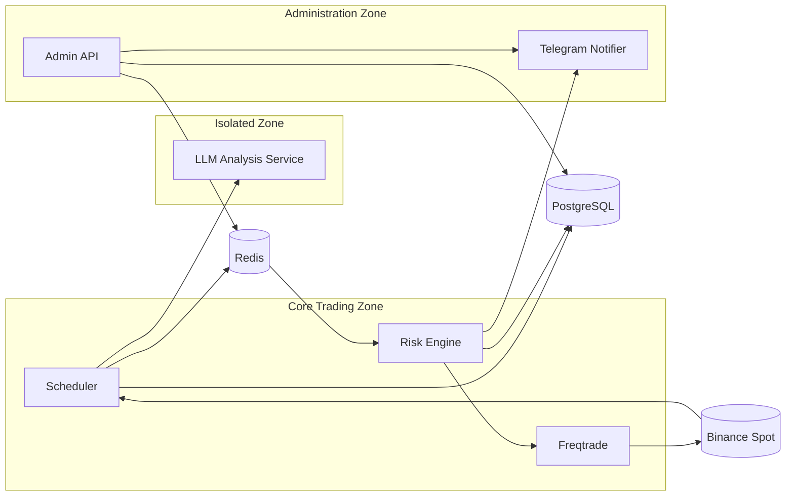

# TradeMind

TradeMind is a self-hosted, AI-assisted cryptocurrency trading platform designed around a simple safety principle:

> **The LLM proposes. The Risk Engine disposes.**

The Large Language Model (LLM) analyzes market data and suggests `BUY`, `SELL`, or `HOLD`. It cannot access exchange credentials, execute orders, or determine position size. Every signal is independently checked by a deterministic Risk Engine before an approved order can reach Freqtrade.

> [!IMPORTANT]
> TradeMind is currently a **draft MVP specification**, not a production-ready trading system. The MVP is limited to Binance Spot, BTC/USDT and ETH/USDT, closed 1-hour candles, long-only positions, and dry-run execution.

## Why TradeMind?

AI can help identify patterns in market data, but probabilistic model output should not have direct control over funds. TradeMind separates analysis from execution so that:

- the LLM has no exchange access or sizing authority;
- deterministic risk rules make the final decision;
- failures and uncertain model output default to `HOLD`;
- every signal, decision, order, and state change is auditable; and
- a human operator can stop new entries with a global kill switch.

## Architecture

TradeMind separates components into three trust zones:



- **Isolated Zone:** analyzes supplied market context only. It has no Binance or Freqtrade credentials, no account balance data, and no execution path.
- **Core Trading Zone:** schedules analysis, applies risk rules, calculates position size and stop-loss values, and sends approved orders to Freqtrade.
- **Administration Zone:** exposes system status and controls, records Freqtrade webhooks, and sends Telegram notifications. It never places trades directly.

PostgreSQL is the durable audit system of record. Redis is used only for coordination, streams, locks, idempotency, cached state, and the kill-switch flag.

## Trading flow

For each supported pair, one cycle runs after a 1-hour candle closes:

1. The Scheduler obtains a per-symbol lock and fetches closed candle data.
2. Indicators such as RSI, EMA, MACD, ATR, and volume averages are calculated.
3. The LLM returns a structured `BUY`, `SELL`, or `HOLD` opinion with confidence and reasoning.
4. The signal is persisted to PostgreSQL and published through Redis.
5. The Risk Engine checks the kill switch first, then evaluates freshness, confidence, exposure, losses, cooldowns, balance, and other limits.
6. If every rule passes, the Risk Engine calculates position size and stop-loss values using fixed-point arithmetic.
7. Freqtrade submits the approved order in dry-run mode and reports order and position updates for auditing.

Malformed responses, timeouts, unavailable dependencies, or ambiguous signals fail closed: no new trade is approved.

## Checking system state

All examples assume `.env` is populated (see [DEPLOYMENT.md](DEPLOYMENT.md)) and the stack is running via `docker compose up -d`. Export the credentials once per shell session:

```bash
set -a; source .env; set +a
```

### Admin API (port 8000)

```bash
# overall status: killswitch, equity, open positions, last cycle per pair
curl -sS -H "Authorization: Bearer ${ADMIN_API_KEY}" http://127.0.0.1:8000/status

# every signal the system generated
curl -sS -H "Authorization: Bearer ${ADMIN_API_KEY}" "http://127.0.0.1:8000/signals?limit=20"

# every risk decision — approved or rejected, with the reason
curl -sS -H "Authorization: Bearer ${ADMIN_API_KEY}" "http://127.0.0.1:8000/decisions?limit=20"

# every order (submitted/filled/failed/cancelled); filter by symbol/status
curl -sS -H "Authorization: Bearer ${ADMIN_API_KEY}" "http://127.0.0.1:8000/orders?limit=20"
curl -sS -H "Authorization: Bearer ${ADMIN_API_KEY}" "http://127.0.0.1:8000/orders?symbol=BTC/USDT&status=FAILED"

# open/closed positions
curl -sS -H "Authorization: Bearer ${ADMIN_API_KEY}" "http://127.0.0.1:8000/positions?status=open"

# full timeline for one trading cycle (signal -> decision -> order -> position)
curl -sS -H "Authorization: Bearer ${ADMIN_API_KEY}" "http://127.0.0.1:8000/audit?trace_id=<uuid>"

# manually trigger a cycle out-of-band (still subject to all risk rules)
curl -sS -X POST -H "Authorization: Bearer ${ADMIN_API_KEY}" http://127.0.0.1:8000/cycles/BTC-USDT/trigger

# kill switch
curl -sS -X POST -H "Authorization: Bearer ${ADMIN_API_KEY}" -H "Content-Type: application/json" \
  -d '{"reason": "manual review"}' http://127.0.0.1:8000/killswitch/enable
curl -sS -X POST -H "Authorization: Bearer ${ADMIN_API_KEY}" -H "Content-Type: application/json" \
  -d '{"reason": "resuming"}' http://127.0.0.1:8000/killswitch/disable
```

### Freqtrade API (port 8080, direct)

Freqtrade's own trade database is not the audit system of record (PROJECT.md Section 7) — use these for raw/direct inspection, but the admin API above is authoritative.

```bash
curl -sS -u "${FREQTRADE_API_USER}:${FREQTRADE_API_PASS}" http://127.0.0.1:8080/api/v1/ping
curl -sS -u "${FREQTRADE_API_USER}:${FREQTRADE_API_PASS}" http://127.0.0.1:8080/api/v1/balance
curl -sS -u "${FREQTRADE_API_USER}:${FREQTRADE_API_PASS}" http://127.0.0.1:8080/api/v1/status
curl -sS -u "${FREQTRADE_API_USER}:${FREQTRADE_API_PASS}" http://127.0.0.1:8080/api/v1/trades
curl -sS -u "${FREQTRADE_API_USER}:${FREQTRADE_API_PASS}" http://127.0.0.1:8080/api/v1/profit
```

More monitoring commands (logs, Postgres queries, Redis checks, backups) are in [DEPLOYMENT.md](DEPLOYMENT.md).

## MVP scope

| Area | MVP choice |
|---|---|
| Exchange | Binance Spot |
| Pairs | BTC/USDT and ETH/USDT |
| Timeframe | Closed 1-hour candles |
| Position type | Long-only spot |
| Execution | Freqtrade, dry-run only |
| Analysis | One configured LLM provider |
| Storage | PostgreSQL and Redis |
| Operator interfaces | FastAPI admin API and Telegram |
| Deployment | Self-hosted with Docker Compose |

Live funds, leverage, shorting, multiple exchanges, additional pairs or timeframes, model ensembles, and a user-facing web UI are intentionally outside the MVP.

## Safety guarantees

- The LLM cannot call Binance or Freqtrade.
- Every actionable signal must pass through the Risk Engine.
- The kill switch is always evaluated before any other risk rule.
- Position sizing is owned exclusively by the Risk Engine.
- Approved entries always include a stop loss.
- Duplicate candles and redelivered signals cannot create duplicate orders.
- If PostgreSQL, Redis, the LLM service, or execution dependencies fail, the system does not approve a new trade.
- All MVP orders remain in dry-run mode unless a human explicitly changes the project scope and configuration.

## Planned components

The proposed monorepo contains:

- `services/llm_service` — structured market analysis and safe `HOLD` fallback;
- `services/scheduler` — closed-candle scheduling, market data, and indicators;
- `services/risk_engine` — deterministic rules, sizing, and execution authorization;
- `services/admin_api` — status, audit, configuration, kill-switch, and webhook APIs;
- `services/notifier` — Telegram event notifications;
- `services/common` — shared typed models, configuration, database code, and Redis keys; and
- `freqtrade` — dry-run order execution with no autonomous entry strategy.

Implementation is planned in phases: foundations, data and LLM integration, Risk Engine, dry-run execution, administration and notifications, then hardening and scheduling.

## Project status

All services described above are implemented and run via Docker Compose (see [DEPLOYMENT.md](DEPLOYMENT.md) for first-deployment steps). PROJECT.md Section 13's remaining acceptance item is operational, not code: a 72-hour unattended dry run with a fully consistent audit trail.

Read [PROJECT.md](PROJECT.md) for the complete architecture, contracts, risk rules, API design, development phases, and acceptance criteria. Contributors and coding agents should also read [AGENTS.md](AGENTS.md) before making changes.

Deployment, backup, and operational monitoring commands are documented in
[DEPLOYMENT.md](DEPLOYMENT.md).

## Disclaimer

TradeMind is an experimental software project, not financial advice. Cryptocurrency trading involves substantial risk. The MVP is explicitly designed for simulated dry-run execution and should not be used with real funds.
