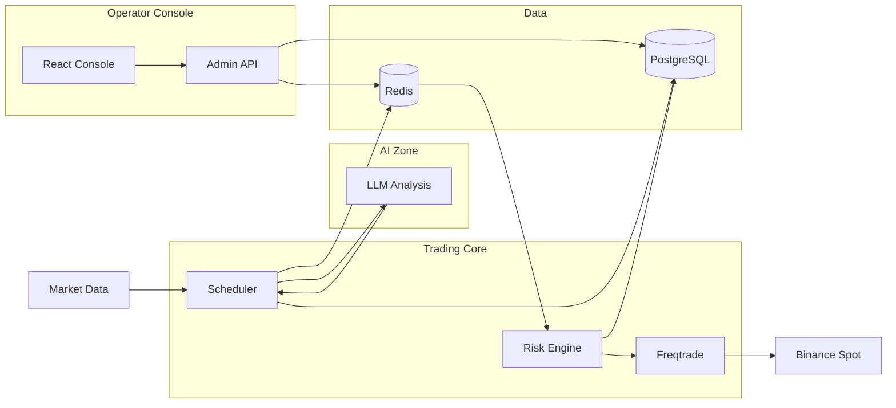
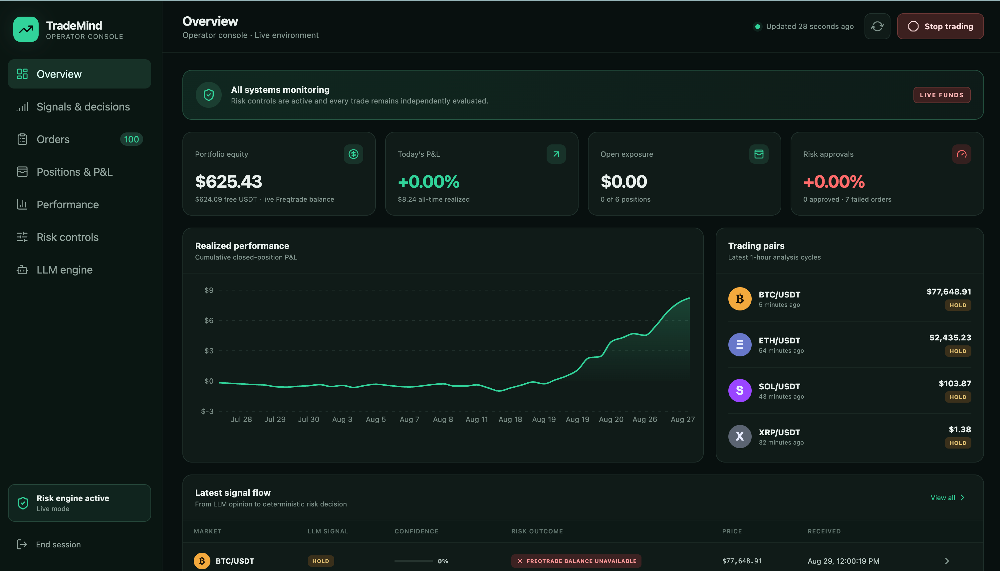
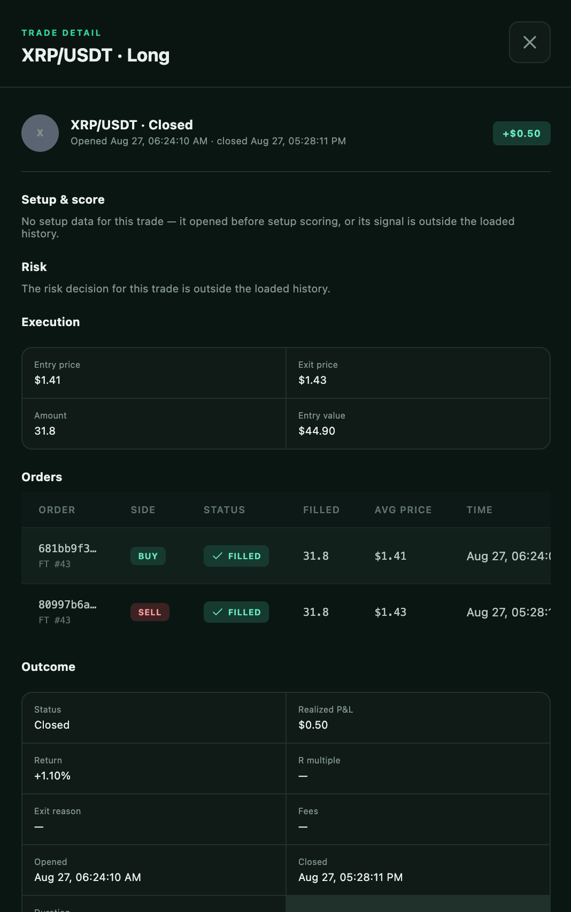

# TradeMind

> **The LLM proposes. The Risk Engine disposes.**

AI-assisted cryptocurrency trading system built around **deterministic risk controls, auditable decisions, and measurable trading performance**.

TradeMind separates market analysis from trade execution: the LLM can propose a trade, but a deterministic Risk Engine decides whether that trade is allowed.

> ⚠️ **Experimental / Dry-run only.** TradeMind is not production-ready and should not be used with real funds.

---

## Why TradeMind?

Most AI trading experiments follow a simple path:

```text
Market → LLM → BUY → Execute
```

TradeMind introduces a hard boundary between **AI reasoning** and **financial execution**:

```text
Market Data
     ↓
LLM Analysis
     ↓
Structured Signal
     ↓
Risk Engine
     ↓
Approved / Rejected
     ↓
Freqtrade
     ↓
Trade
     ↓
Journal
     ↓
Performance
```

The LLM provides a **hypothesis**.

The Risk Engine decides whether that hypothesis is allowed to become a trade.

---

## Architecture


```mermaid
flowchart LR
    Market[Market Data] --> Scheduler

    subgraph AI["AI Zone"]
        LLM[LLM Analysis]
    end

    subgraph Core["Trading Core"]
        Scheduler[Scheduler]
        Risk[Risk Engine]
        Freqtrade[Freqtrade]
    end

    subgraph Data["Data"]
        DB[(PostgreSQL)]
        Redis[(Redis)]
    end

    subgraph Console["Operator Console"]
        API[Admin API]
        FE[React Console]
    end

    Binance[Binance Spot]

    Scheduler --> LLM
    LLM --> Scheduler

    Scheduler --> Redis
    Redis --> Risk

    Risk --> Freqtrade
    Freqtrade --> Binance

    Scheduler --> DB
    Risk --> DB

    API --> DB
    API --> Redis
    FE --> API
```

### Trust boundaries

| Component     | Responsibility           | Can execute trades? |
| ------------- | ------------------------ | ------------------: |
| LLM           | Market analysis          |                   ❌ |
| Scheduler     | Data & orchestration     |                   ❌ |
| Risk Engine   | Risk validation & sizing |                   ❌ |
| Freqtrade     | Order execution          |                   ✅ |
| Admin API     | Monitoring & control     |                   ❌ |
| React Console | Operator interface       |                   ❌ |

The LLM and Risk Engine do not have direct access to exchange credentials.

---

## Operator Console

The React operator console provides a single place to observe and operate the system.



The console currently provides visibility into:

* System health
* Market signals
* Risk decisions
* Trades and positions
* Trade history
* Performance
* Risk controls
* Audit information
* LLM analysis

The UI is intentionally designed as an **operator console**, not a consumer trading dashboard.

---

## Trading Lifecycle

A typical trading cycle looks like this:

```text
┌──────────────┐
│ Market Data  │
└──────┬───────┘
       ↓
┌──────────────┐
│ LLM Analysis │
└──────┬───────┘
       ↓
┌──────────────┐
│   Signal     │
│ BUY/SELL/HOLD│
└──────┬───────┘
       ↓
┌──────────────┐
│ Risk Engine  │
└──────┬───────┘
       │
   ┌───┴────┐
   ↓        ↓
APPROVE    REJECT
   ↓        ↓
Freqtrade  HOLD
   ↓
Position
   ↓
Trade Journal
   ↓
Performance
```

The Risk Engine validates the signal before any order can be executed.

---

## Risk First

TradeMind uses deterministic rules for the parts of trading that should not depend on an LLM.

The Risk Engine controls:

* Position sizing
* Stop loss
* Risk per trade
* Exposure limits
* Confidence thresholds
* Cooldowns
* Loss limits
* Kill switch
* Duplicate protection
* Stale signal protection

If required information is missing or a safety check fails:

```text
LLM timeout
Invalid signal
Stale market data
Risk violation
System dependency failure
        ↓
       HOLD
```

**Fail closed.**

---

## Trade Journal

TradeMind records the complete lifecycle of a trade rather than only its final P&L.



A trade can include:

```text
Trade
├── Market
├── Side
├── Setup regime
├── Volatility regime
├── Trade score
├── Risk
├── Entry
├── Stop Loss
├── Take Profit
├── Exit
├── Fees
├── Exit reason
└── R multiple
```

This makes each trade observable and auditable.

### Trade Score

Signals can be scored from **0–100** using deterministic factors such as:

* Trend
* Momentum
* Volume
* Market regime
* Risk / Reward
* Volatility

The score breakdown is persisted with the trade so the decision can be inspected later.

---

## Performance

TradeMind focuses on **risk-normalized performance**, not just raw P&L.

Key metrics include:

```text
Win Rate
Expectancy
Total R
Profit Factor
Drawdown
Average Win / Loss
```

The goal is to answer:

> **Does the strategy actually have an edge?**

rather than simply:

> Did the last trade make money?

---

## Core Principles

### AI proposes, deterministic systems decide

LLMs are useful for market interpretation, but they should not directly control capital.

### Fail closed

When the system cannot safely validate a trade, the default action is `HOLD`.

### Auditable by default

Signals, risk decisions, trades, and outcomes are persisted for later inspection.

### Measure before scaling

A strategy should demonstrate positive expectancy through backtesting, walk-forward validation, and paper trading before real capital is considered.

---

## Current MVP

| Area           | Current                 |
| -------------- | ----------------------- |
| Exchange       | Binance Spot            |
| Execution      | Freqtrade               |
| Execution Mode | Dry-run                 |
| Timeframe      | Closed 5-minute candles |
| Position Mode  | Long-only               |
| Storage        | PostgreSQL + Redis      |
| Backend        | Python / FastAPI        |
| Frontend       | React / TypeScript      |
| Deployment     | Docker Compose          |
| Notifications  | Telegram                |

### Current limitations

* Dry-run only
* Long positions only
* Single exchange
* Single configured LLM provider
* Experimental strategy
* Not production-ready

---

## Tech Stack

### Backend

* Python
* FastAPI
* PostgreSQL
* Redis

### Trading

* Freqtrade
* Binance Spot

### Frontend

* React
* TypeScript

### Infrastructure

* Docker Compose
* Nginx

### AI

* Configurable LLM provider

### Notifications

* Telegram

---

## Project Structure

```text
TradeMind/
├── services/
│   ├── llm_service/       # LLM market analysis
│   ├── scheduler/         # Market data & scheduling
│   ├── risk_engine/       # Deterministic risk controls
│   ├── admin_api/         # Monitoring & administration
│   ├── notifier/          # Notifications
│   └── common/            # Shared models & configuration
│
├── frontend/              # React operator console
├── freqtrade/             # Trading execution
│
├── docs/
│   └── images/             # README screenshots
│
├── PROJECT.md             # Architecture & requirements
├── DEPLOYMENT.md          # Deployment & operations
└── AGENTS.md              # Coding-agent guidance
```

---

## Quick Start

### Requirements

* Docker
* Docker Compose
* Binance API configuration
* LLM provider API key

### Run

```bash
git clone https://github.com/quang-ng/TradeMind.git
cd TradeMind

cp .env.example .env
# Configure .env

docker compose up -d
```

Open the operator console:

```text
http://127.0.0.1:3000
```

Admin API:

```text
http://127.0.0.1:8000
```

For detailed setup and operational instructions, see:

* `DEPLOYMENT.md`
* `PROJECT.md`

---

## Roadmap

```text
M1  Risk & R
 ↓
M2  Trade Journal
 ↓
M3  Performance
 ↓
M4  Regime Analysis
 ↓
M5  Historical Edge
 ↓
M6  Backtest & Walk-forward Validation
```

### M1 — Risk & R

* Risk-per-trade
* Position sizing
* Stop-loss validation
* R multiple

### M2 — Trade Journal

* Complete trade lifecycle
* Trade scoring
* Market regime
* Volatility regime
* Exit reason
* Fees
* R-normalized outcomes

### M3 — Performance

* Expectancy
* Profit factor
* Drawdown
* R-based performance

### M4 — Regime Analysis

* Performance by market regime
* Setup analysis
* Trade score analysis

### M5 — Historical Edge

* Historical expectancy
* Setup validation
* Statistical edge detection

### M6 — Validation

```text
Backtest
   ↓
Walk-forward
   ↓
Paper Trading
   ↓
Small Capital
   ↓
Production
```

---

## Documentation

* **[PROJECT.md](PROJECT.md)** — Architecture, system contracts, risk rules and requirements
* **[DEPLOYMENT.md](DEPLOYMENT.md)** — Deployment and operations
* **[AGENTS.md](AGENTS.md)** — Development guidance for coding agents

---

## Safety

TradeMind is an experimental software project and **not financial advice**.

Cryptocurrency trading involves substantial financial risk.

The current system is designed for **dry-run execution** and should not be used with real funds.

---

## License

See [LICENSE](LICENSE).
