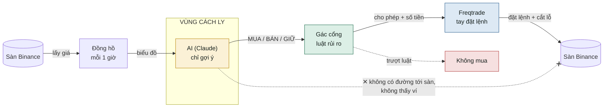
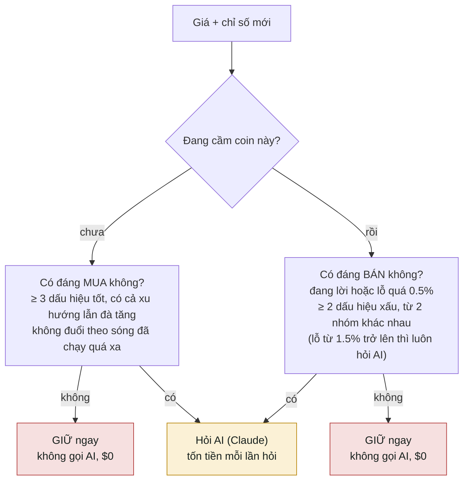
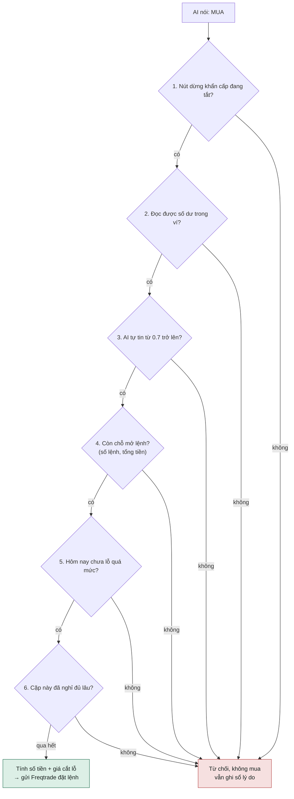
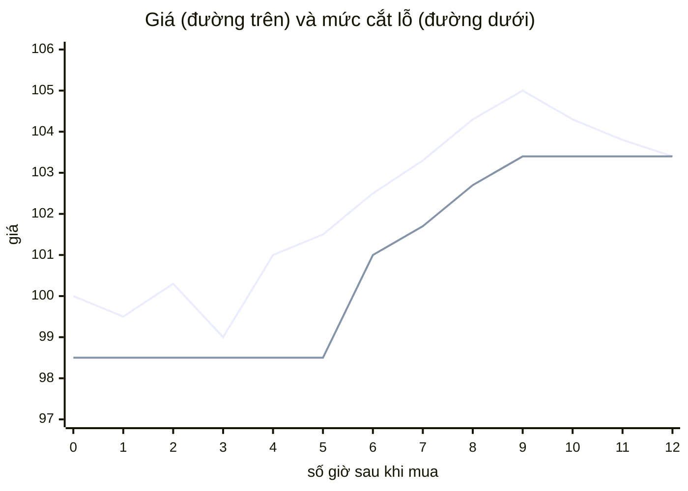
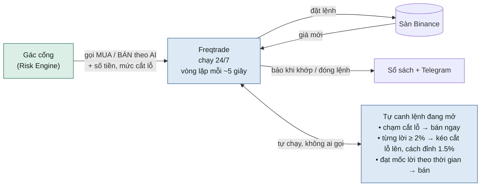

# TradeMind chạy thế nào?

Một con bot tự mua bán coin trên Binance. Mỗi giờ nó xem giá, hỏi AI, rồi để một "người gác cổng" quyết định có được đặt lệnh hay không.

> **AI chỉ được gợi ý. Không được cầm tiền.**
> Quyết định cuối cùng và số tiền mỗi lệnh do bộ luật cố định tính, không phải AI.

Tài liệu này viết cho người không rành kỹ thuật. Chi tiết kỹ thuật đầy đủ nằm trong [PROJECT.md](../PROJECT.md).

---

## Hình 1 · Ai được nói chuyện với ai

AI bị nhốt trong vùng cách ly: nó chỉ nhận biểu đồ và trả lời một câu. Chỉ có Freqtrade cầm chìa khóa sàn, và Freqtrade chỉ nghe lệnh từ người gác cổng.

---

## Từng bước một

| # | Ai làm | Làm gì |
|---|---|---|
| 1 | **Đồng hồ** · mỗi giờ, phút :00:15–:00:30 | Tải nến 1 giờ của BTC, ETH, SOL, XRP từ Binance và tính các chỉ số kỹ thuật (RSI, MACD, đường trung bình…) |
| 2 | **Bộ lọc** · trước khi hỏi AI | Tự đếm các dấu hiệu trên biểu đồ. Nếu chưa đủ thì dù AI nói gì cũng bị ép thành GIỮ, nên trả luôn **GIỮ** mà không gọi AI. Khoảng 81% số lần rơi vào trường hợp này (Hình 2) |
| 3 | **AI (Claude)** · vùng cách ly | Trả lời MUA, BÁN hoặc GIỮ, kèm mức tự tin từ 0 đến 1 và lý do. Trả lời lỗi, chậm quá hoặc sai định dạng thì tự động tính là **GIỮ**. AI nói MUA mà số liệu không ủng hộ thì cũng bị ép về GIỮ |
| 4 | **Người gác cổng** · bộ luật rủi ro | Kiểm tra lần lượt từng luật (Hình 3). Qua hết thì tự tính **vào bao nhiêu tiền** và **giá cắt lỗ**. Trượt một luật là không mua |
| 5 | **Freqtrade** · tay đặt lệnh | Mua đúng số tiền đã tính, khoảng 20 giây sau khi nến đóng. Từ đó tự canh giá mỗi ~5 giây và tự bán khi chạm cắt lỗ hoặc đạt mốc lời (Hình 5) |
| 6 | **Sổ sách + báo tin** | Mọi ý kiến AI, mọi lần từ chối, mọi lệnh đều ghi vào cơ sở dữ liệu. Có lệnh mua/bán thì nhắn Telegram, thứ Hai hằng tuần gửi email tổng kết lời lỗ |

---

## Hình 2 · Bộ lọc trước khi hỏi AI

Bộ lọc dùng đúng bộ luật đang kiểm tra câu trả lời của AI. Nó chỉ bỏ qua những lần mà AI có nói gì cũng bị ép thành GIỮ, nên không mất lệnh nào. Khoảng 81% số lần rơi vào ô đỏ, tiền AI giảm từ khoảng $25 xuống khoảng $5 mỗi tháng.

---

## Hình 3 · Người gác cổng lọc thế nào

Qua lần lượt từng cửa, cửa nào nói "không" là dừng luôn. Số tiền mỗi lệnh chỉ được tính ở cuối phễu, AI không có quyền quyết.

---

## Hình 4 · Một lệnh từ lúc mua đến lúc bán

Ví dụ: mua ở giá 100, cắt lỗ ban đầu ở 98.5.

Vừa mua xong là có mức cắt lỗ. Khi lệnh từng lời từ 2% trở lên, mức cắt lỗ được kéo lên theo, luôn cách đỉnh 1.5%, và không bao giờ hạ xuống. Ở ví dụ này giá lên đỉnh 105 ở giờ thứ 9, rồi quay đầu chạm mức 103.4 ở giờ thứ 12, bot tự bán và lời 3.4%. Nếu giá rơi ngay từ đầu thì chạm cắt lỗ ban đầu, lỗ ít. Ngoài ra bot cũng bán khi đạt mốc lời định sẵn hoặc khi AI nói BÁN.

---

## Hình 5 · Freqtrade làm việc thế nào

Freqtrade **không bao giờ tự mua**. Nó chỉ mua (và bán theo ý AI) khi người gác cổng gọi. Nhưng lệnh đã mở thì nó tự canh, nên AI hay đồng hồ có chết thì cắt lỗ và chốt lời vẫn chạy.

**Mốc chốt lời theo thời gian:** giữ lệnh càng lâu thì mức lời cần để bán càng thấp.

| Đã giữ lệnh | Lời bao nhiêu thì bán |
|---|---|
| ngay từ đầu | 6% |
| sau 4 giờ | 3% |
| sau 12 giờ | 2% |
| sau 1 ngày | 1.5% |
| sau 2 ngày | 1% |
| sau 4 ngày | 0.5% |

**Từ lúc nến đóng tới lúc đặt lệnh** (ví dụ BTC):

| Lúc | Việc |
|---|---|
| 10:00:00 | Nến 1 giờ đóng |
| 10:00:15 | Đồng hồ lấy giá (chờ 15 giây cho Binance chốt nến). ETH, SOL, XRP chạy sau, mỗi cặp cách 5 giây |
| ~10:00:20 | Bộ lọc + AI trả lời, người gác cổng duyệt |
| ~10:00:21 | Freqtrade gửi lệnh mua lên Binance. Lệnh chờ khớp tối đa 10 phút, quá thì tự hủy |

Bot không cần nhanh từng giây vì nó đánh theo nến 1 giờ và giữ lệnh hàng giờ đến vài ngày. Tín hiệu chỉ thay đổi khi nến đóng, nên kiểm tra dày hơn cũng không ra thêm gì.

**Sắp có:** đặt sẵn lệnh cắt lỗ ngay trên sàn Binance, để máy chủ có sập thì lệnh cắt lỗ vẫn nằm đó. Bot vẫn tự canh song song như hiện nay.

---

## Con người nằm ở đâu?

- **Trang quản trị:** xem lệnh, lời lỗ, lịch sử quyết định trên trình duyệt.
- **Nút dừng khẩn cấp:** bấm một cái là bot ngừng mở lệnh mới ngay.
- **Telegram:** nhận tin mỗi khi bot mua hoặc bán, và khi có sự cố.

## Luật an toàn

- **Không chắc thì GIỮ.** Có gì mập mờ, lỗi, hay quá giờ thì mặc định không làm gì.
- **Hỏng một khâu thì dừng.** Không đọc được số dư hay mất kết nối cơ sở dữ liệu thì không đặt lệnh.
- **Chỉ mua, không bán khống.** Giao dịch spot, không đòn bẩy, không vay.

---

**Tóm lại:** đồng hồ gọi → bộ lọc xem có đáng hỏi không → AI gợi ý → người gác cổng duyệt và tính tiền → Freqtrade đặt lệnh rồi tự canh cắt lỗ, chốt lời → ghi sổ và báo Telegram.
