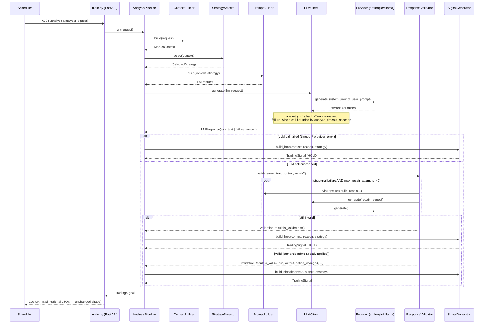
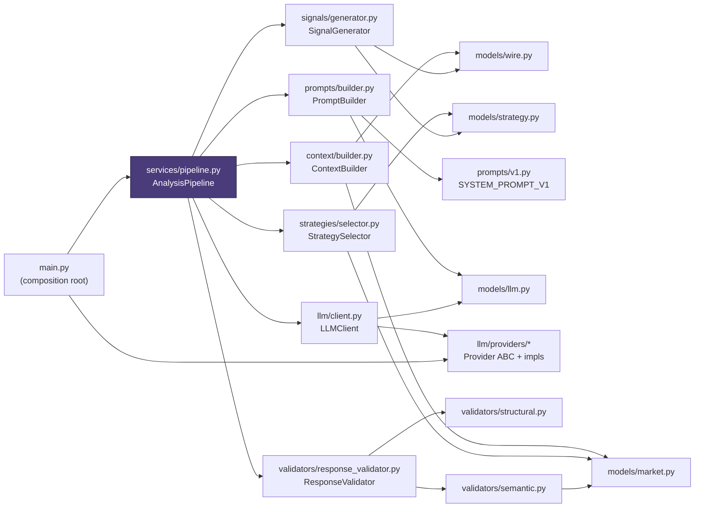

# LLM Analysis Service — Pipeline Architecture

This document covers the internal refactor of `llm_service` from a
three-file (`main.py` / `validators.py` / `semantic_validator.py`) monolith
into the six-stage pipeline PROJECT.md Section 8 now describes. It is a
**single-service, internal reorganization**: the Scheduler, Risk Engine,
Freqtrade, PostgreSQL, Redis, and Admin API are all unaware this happened —
`POST /analyze` and `GET /health` are byte-for-byte the same HTTP contract
as before. See PROJECT.md Section 6 for the canonical folder tree and
Section 8 for the contract this pipeline implements.

## 1. Why

The old service mixed six different concerns into three files:
building the prompt, calling the LLM, validating its output, enforcing the
position-aware exit rubric, and shaping the HTTP response were all reachable
from `main.py`'s one `analyze()` function and a pair of same-named helper
modules. Adding a seventh concern (e.g. a second decision rubric, a new
provider, a repair-retry) meant editing code that already had unrelated
responsibilities threaded through it. This refactor gives each concern its
own module and its own unit tests, with a thin composition root (`main.py`)
wiring them together — without changing what the service does.

## 2. Folder structure

```
services/llm_service/
├── app/
│   ├── main.py                     # FastAPI app + DI composition root only
│   ├── models/                     # typed models, no behavior
│   │   ├── wire.py                 #   the /analyze HTTP contract (Section 8)
│   │   ├── market.py               #   MarketContext + its derived-fact models
│   │   ├── strategy.py             #   StrategyName, SelectedStrategy
│   │   └── llm.py                  #   LLMOutput, LLMRequest, LLMResponse, ValidationResult
│   ├── context/
│   │   └── builder.py              # ContextBuilder: AnalyzeRequest -> MarketContext
│   ├── strategies/
│   │   └── selector.py             # StrategySelector: MarketContext -> SelectedStrategy
│   ├── prompts/
│   │   ├── v1.py                   # SYSTEM_PROMPT_V1 + build_user_prompt (unchanged text)
│   │   └── builder.py              # PromptBuilder: (MarketContext, SelectedStrategy) -> LLMRequest
│   ├── llm/
│   │   ├── client.py               # LLMClient: retry/timeout wrapper around one Provider
│   │   └── providers/              # Provider ABC + anthropic/ollama implementations (moved as-is)
│   ├── validators/
│   │   ├── structural.py           # parse_llm_response (JSON/schema/enum/range checks)
│   │   ├── semantic.py             # position-aware exit rubric enforcement
│   │   └── response_validator.py   # ResponseValidator: orchestrates the two + optional repair
│   ├── signals/
│   │   └── generator.py            # SignalGenerator: ValidationResult -> TradingSignal
│   └── services/
│       └── pipeline.py             # AnalysisPipeline: wires every stage above together
├── Dockerfile                      # unchanged — CMD ["uvicorn", "app.main:app", ...] still resolves
└── tests/                          # one test module per stage, plus the end-to-end endpoint tests
```

Every stage is a plain class with injected dependencies (no globals, no
service locator) — `main.py`'s `_build_pipeline()` is the only place that
constructs them together.

## 3. Sequence diagram



## 4. Dependency graph



No arrows point back "up" the diagram — each stage depends only on models
and on nothing that depends on it, so there are no circular imports.
`ModelsWire` (the `/analyze` HTTP contract) is the one module every other
package may import; it imports nothing from within `llm_service` itself.

## 5. Pydantic models

| Model | File | Role |
|---|---|---|
| `AnalyzeRequest`, `TradingSignal`, `Candle`, `MACD`, `Indicators`, `PositionContext`, `ProviderOverride` | `models/wire.py` | The `/analyze` HTTP contract (PROJECT.md Section 8). `TradingSignal` is the renamed `Signal` response model — same field names/shapes, renamed only to avoid confusion with `common.db.models.Signal` (the persisted row) inside this codebase. |
| `MarketContext`, `TrendMetrics`, `MomentumMetrics`, `VolatilityMetrics`, `VolumeMetrics` | `models/market.py` | Context Builder's output. `MarketContext` retains the original `AnalyzeRequest` (`.request`) so `PromptBuilder` can reproduce the exact Section 8.1 JSON without re-deriving pydantic dump semantics, alongside derived facts (`.trend`, `.momentum`, `.volatility`, `.volume`, `.exit_confirmations`) for the Strategy Selector and Response Validator. |
| `StrategyName`, `SelectedStrategy` | `models/strategy.py` | Strategy Selector's output: a regime label, runner-up regimes, and why. |
| `LLMOutput` | `models/llm.py` | The parsed/validated `{action, confidence, reasoning, key_indicators, invalidation_condition}` contract (Section 8.2). |
| `LLMRequest`, `LLMResponse` | `models/llm.py` | What `PromptBuilder` hands to `LLMClient`, and what `LLMClient` hands back. |
| `ValidationResult` | `models/llm.py` | Response Validator's output: valid/invalid, the (possibly semantically-normalized) `LLMOutput`, the model's original pre-normalization action, and exit-confirmation bookkeeping for the audit trail. |

All are `pydantic.BaseModel`; every model that is a pure value (not the
mutable wire request) is `ConfigDict(frozen=True)`.

## 6. Interfaces

Python has no `interface` keyword, so "interface" here means: a small class
or callable type every implementation/caller agrees on.

- **`Provider`** (`llm/providers/base.py`, unchanged) — `async def generate(system_prompt, user_prompt) -> str`, plus `model`/`provider_name` properties. `AnthropicProvider` and `OllamaProvider` implement it; `LLMClient` depends only on this, never on a concrete provider.
- **`RepairFn`** (`validators/response_validator.py`) — `Callable[[str, str], Awaitable[str | None]]`. `ResponseValidator` never constructs one itself (that would need `PromptBuilder` + `LLMClient`, which are not its concerns); `AnalysisPipeline` supplies it as a closure.
- Every stage class (`ContextBuilder`, `StrategySelector`, `PromptBuilder`, `LLMClient`, `ResponseValidator`, `SignalGenerator`) exposes exactly the one or two methods `AnalysisPipeline` calls and takes its dependencies as constructor arguments — there is no shared base class, since they have nothing in common beyond "one pipeline stage" and forcing one would be an abstraction with no payoff.

## 7. Design decisions

**The decision rubric itself did not move into the Strategy Selector.**
PROJECT.md's target architecture describes a Strategy Selector that picks
between named strategies (trend following, mean reversion, momentum
continuation, trend pullback). This refactor implements that classifier for
real — `strategies/selector.py` is deterministic, calls no LLM, proposes no
action, and is fully unit tested — but its result does not yet branch
`SYSTEM_PROMPT_V1` or `validators/semantic.py`'s rubric. Doing so would
change which BUY/SELL/HOLD calls the service makes today, and the task
requires external behavior to stay unchanged. `SelectedStrategy` is instead
attached to `TradingSignal.raw_response` (`strategy_selected`,
`strategy_reasoning`) as real, visible metadata, and — when explicitly
enabled — surfaced to the model as framing text. Wiring a strategy-specific
rubric later is a `PromptBuilder`/`validators` change, not an architecture
change; the seam already exists.

**No ADX input exists, so trend strength is proxied from EMA separation.**
The Scheduler computes RSI/EMA50/EMA200/MACD/ATR/volume-SMA20 and nothing
else (PROJECT.md Section 8.1); adding ADX would mean changing the
Scheduler, which is out of scope. `TrendMetrics.ema_gap_pct` — the signed
`(ema_50 - ema_200) / ema_200` — stands in for "is this trending," and
`MomentumMetrics.histogram_atr_ratio` (volatility-normalized MACD
histogram) stands in for "is this a momentum burst." Both are documented as
proxies in `context/builder.py` and `strategies/selector.py`, not
presented as the real indicator.

**Two capabilities are fully built but off by default: strategy-context
prompt framing and the repair-prompt retry.** Both are named directly in
the target architecture ("inject selected strategy" into the prompt; "retry
using repair prompt" on a Response Validator failure), and both are
implemented completely — not stubs — with dedicated tests
(`test_prompt_builder.py`, `test_response_validator.py`). Both are gated by
new `LLMServiceSettings` fields (`include_strategy_context_in_prompt`,
`max_repair_attempts`) defaulting to values that reproduce the exact
pre-refactor behavior: the prompt text sent to the LLM is byte-identical,
and a malformed/schema-invalid response still goes straight to `HOLD`
with no retry. Turning either on is a real behavior change to what gets
proposed to the Risk Engine, and the task's constraint is that this
refactor must not make that change unilaterally — so it's wired, tested,
and left to an explicit operator decision (also noted in PROJECT.md
Section 8.3).

**`raw_response` enrichment only ever adds to an existing dict, never
turns `null` into one.** `SignalGenerator` attaches `strategy_selected`,
`strategy_reasoning`, and `generated_at` to `raw_response` — but only when
`raw_response` is already a dict (the structurally-invalid and successful
paths). A total provider failure (timeout / `provider_error`) still
produces `raw_response=None` exactly as before; that field flipping from
`null` to an object would be an observable, if minor, contract change for
a path this refactor is not supposed to touch.

**`Signal` was renamed to `TradingSignal`.** This codebase already has a
different `Signal` — the SQLAlchemy row in `common/db/models.py` that the
Scheduler persists from this response — and the two have historically
shared a name across two different layers. Renaming the pydantic response
model does not change the JSON it produces (FastAPI serializes by field
name, not class name), so the Scheduler is unaffected; it does remove a
long-standing naming collision inside this codebase.

**Exit-confirmation facts moved to the Context Builder; the rubric that
judges them stayed in the Response Validator.** The old
`semantic_validator.py` both computed the bearish-exit predicates (price
vs. EMAs, MACD sign, RSI threshold, higher/lower highs, volume) *and*
decided what they meant. `context/builder.py` now computes those predicates
unconditionally as `MarketContext.exit_confirmations`;
`validators/semantic.py` only interprets them (category-spanning check,
profit-margin gate). This is the one place duplicated reasoning was
actually removed, versus e.g. the descriptive `TrendMetrics`/
`MomentumMetrics` computed alongside it, which intentionally do **not**
share code with the exit-confirmation predicates — they encode different
thresholds for different purposes (see the docstring in
`context/builder.py`), and forcing them to share a code path would make
both harder to read for a fake-DRY win.

**`news_summary` and `support_resistance` were deliberately not added
to `MarketContext`.** PROJECT.md's target architecture lists them as
possible Context Builder inputs, but the Scheduler does not send them
today, so there is no consumer — adding the fields now would mean two
never-populated pydantic fields (a "half-finished implementation" smell).
Extending `MarketContext`, `ContextBuilder`, `AnalyzeRequest`, and
PROJECT.md Section 8.1 together, when that data actually exists, is a
small and contained change; the pipeline shape does not need to change to
make it.

## 8. Migration notes

**What changed:**
- `app/schemas.py` → `app/models/wire.py` (`Signal` → `TradingSignal`) + `app/models/{market,strategy,llm}.py` (new internal types).
- `app/validators.py` → `app/validators/structural.py` (parsing) + `app/signals/generator.py` (`build_hold_signal`/`build_signal` → `SignalGenerator.build_hold`/`build_signal`).
- `app/semantic_validator.py` → `app/validators/semantic.py`, now reading `MarketContext.exit_confirmations` instead of recomputing them from a raw `AnalyzeRequest`.
- `app/providers/*` → `app/llm/providers/*` (contents unchanged); `main.py`'s inline retry/timeout logic (`_call_provider_with_retry`) → `app/llm/client.py`'s `LLMClient`.
- `app/prompts/v1.py` kept in place (`SYSTEM_PROMPT_V1` and `build_user_prompt` text and behavior byte-for-byte unchanged); `app/prompts/builder.py` added.
- `app/main.py` shrank to a FastAPI app + DI composition root; all orchestration/logging that used to live in `analyze()` moved to `app/services/pipeline.py`'s `AnalysisPipeline`.
- Two new `LLMServiceSettings` fields, both defaulting to today's behavior: `max_repair_attempts: int = 0`, `include_strategy_context_in_prompt: bool = False`.
- PROJECT.md Section 6 (llm_service tree) and Section 8 (file references, pipeline description, `max_repair_attempts` mention) updated to match.

**What did not change:**
- `POST /analyze` request/response JSON shapes, `GET /health`, all documented failure-mode reasons (`llm_timeout`, `provider_error`, `malformed_json`, `schema_invalid`, `invalid_action`, `invalid_confidence`) and their retry semantics.
- `SYSTEM_PROMPT_V1`'s text, and therefore every decision the LLM is asked to make.
- The position-aware exit rubric's thresholds and behavior (`validators/semantic.py`).
- `Dockerfile` (`CMD ["uvicorn", "app.main:app", ...]` still resolves — verified against the flattened `COPY services/llm_service/app ./app` layout it actually runs under).
- The Scheduler, Risk Engine, Freqtrade, PostgreSQL, Redis, and Admin API — none were touched, and none needed to be.

**How to verify:** `services/llm_service/tests/test_analyze_endpoint.py`
required only two import-path edits (no assertion changes) to pass unchanged
against the new pipeline — the strongest available evidence that the
externally-observable behavior is identical to before this refactor.

**How to turn on the new (currently inert) capabilities later:**
- Set `MAX_REPAIR_ATTEMPTS=1` (or higher) to enable the repair-prompt retry on a structural validation failure. Update PROJECT.md Section 8.3's failure-mode table to describe the new behavior in the same change.
- Set `INCLUDE_STRATEGY_CONTEXT_IN_PROMPT=true` to surface the Strategy Selector's regime label to the model as framing text.
- To make the Strategy Selector actually branch the decision rubric (not just label it), extend `PromptBuilder`/`prompts/` with per-strategy prompt variants and/or `validators/semantic.py` with per-strategy thresholds, keyed off `SelectedStrategy.strategy`. No other module needs to change.

## 9. Testing

One test module per pipeline stage, plus the pre-existing end-to-end
`/analyze` tests (updated only where import paths moved) and the untouched
`OllamaProvider` transport tests:

- `test_context_builder.py` — derived-fact computation, zero-denominator guards, empty-`ohlcv` handling.
- `test_strategy_selector.py` — each of the four regimes, alternatives ordering, "never calls the LLM" contract check.
- `test_prompt_builder.py` — static `SYSTEM_PROMPT_V1` assertions (unchanged from before), `build_user_prompt` fidelity, the default-vs-`include_strategy_context` prompt text, and the repair-prompt shape.
- `test_structural_validator.py` — JSON/schema/enum/range validation failure classification.
- `test_semantic_validator.py` — the full exit-rubric matrix (category-spanning, profit-margin gate, position-state gating), now built through `ContextBuilder` instead of a raw request.
- `test_response_validator.py` — the default no-repair path, and the repair-retry mechanism (recovers, exhausts, callback returns `None`) with a mocked repair callback — no real LLM call.
- `test_signal_generator.py` — `raw_response` enrichment rules, including the "never turn `null` into a dict" guarantee.
- `test_analyze_endpoint.py`, `test_ollama_provider.py` — unchanged end-to-end/transport coverage.

All 76 tests in `services/llm_service/tests/` pass, alongside the rest of
the monorepo's test suite (172 passed / 35 skipped) and `ruff check`.
